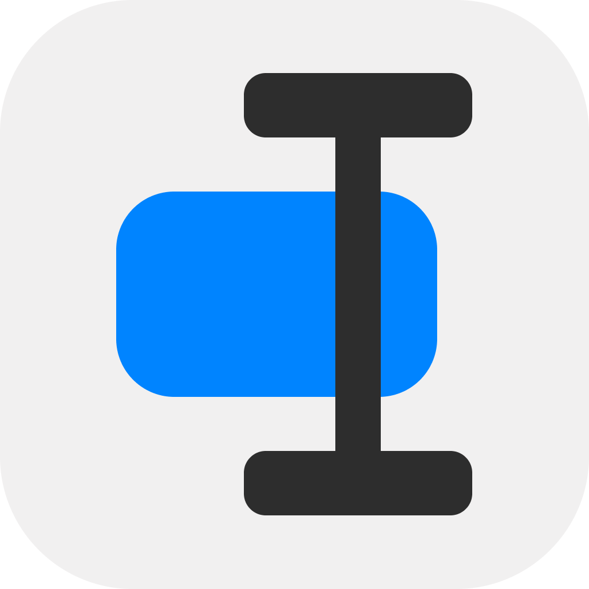

<div align="center">



# OpenClip

**A lightweight floating popup utility for macOS that turns any selected text into instant actions.**

[](https://support.apple.com/sonoma)
[](https://www.swift.org)

[Features](#features) • [Installation](#installation) • [Getting started](#getting-started) • [Extending](#extending-openclip) • [Building from source](#building-from-source) • [Documentation](#documentation) • [License](#license)

</div>

Select any text in any app, and OpenClip appears with contextual actions — copy, cut, paste, web
search, definitions, your scripts, and extensions. A hotkey turns the popup into a fuzzy
**action-search palette** that can reach any action in your catalog without leaving the popup.

> [!NOTE]
> OpenClip reads selected text in real time through macOS Accessibility APIs — it never touches or
> pollutes your clipboard while monitoring, and it logs or stores nothing about your selections.

## Features

- **Instant contextual popup** — select text anywhere and a floating bar appears with the actions that make sense for it. Actions with no live selection (like Copy/Cut) drop out automatically, and a selection-free popup falls back to the current clipboard contents.
- **Action-search palette** — press <kbd>⌥⌘C</kbd> to turn the bar into a fuzzy search field over the *entire* action catalog, including disabled actions. Results are ranked by recency, then bar order, so your most-used actions float to the top.
- **Zero-config builtins** — Search, Copy, Cut, Paste, Services, and a Transform group (UPPERCASE, lowercase, Title Case, camelCase) work out of the box.
- **Extensions** — install `.openclipext` packages (JavaScript, AppleScript, shell, URL templates, key presses, Shortcuts, Services) from the built-in store, a file, or by dropping a folder into `~/.openclip/extensions`. No compile step — a manifest plus a script is a complete extension.
- **Custom actions from the GUI** — add a web-search URL template or an inline shell script straight from Preferences, no manifest authoring required.
- **Built-in AI assistant** — run selected text through Apple Intelligence, a local Ollama model, or a cloud provider (OpenAI/Claude), or hand the query to your browser. AI presets appear as regular actions in the palette.
- **AI presets as first-class actions** — every AI provider/model is a reorderable, toggleable action with its own keyboard-friendly entry point, so the AI flows you use live in the same bar as everything else.
- **Deep customization** — drag to reorder the bar, disable actions, override titles and icons, and pick a Classic or Glass theme (Liquid Glass on macOS 26+, frosted material on 14–15) in System, Light, or Dark.
- **App-specific rules** — scope actions to apps with allow/deny rules, selection regexes, and required options that prompt the user when missing.
- **Fast by design** — Swift 6 with strict concurrency, a pure `Core` domain module, and a hover model that never re-evaluates the whole view per mouse move.

## Installation

1. Download the latest release (`.zip`) from the [releases page](https://github.com/ganeshmshetty/openclip/releases).
2. Drag `OpenClip.app` into your `/Applications` folder.
3. Launch OpenClip and grant **Accessibility** permission when prompted:

   ```
   System Settings → Privacy & Security → Accessibility → enable OpenClip
   ```

> [!IMPORTANT]
> Accessibility permission is required: it's how OpenClip detects selections and reads the selected
> text without relying on the clipboard. You can grant or revoke it any time from Preferences.

First launch walks you through a 4-step onboarding — AI assistant (optional), extensions, and the
popup theme — before text-selection monitoring starts.

## Getting started

**1. Select some text** in any app. The popup bar appears next to your selection:

- Click an action to run it (copy, search, transform, run your extension…).
- Click a group or the AI bar to open a scoped palette of its sub-actions.
- Run an AI action to see its output in a native result card (Replace/Copy buttons; back chevron or Esc to exit).

**2. Use the hotkeys:**

| Shortcut | Action |
| :--- | :--- |
| <kbd>⌥⌘C</kbd> | Toggle the popup (or the action-search palette if the bar is up) |
| <kbd>Esc</kbd> | Dismiss the popup / drop back from a scoped palette |
| <kbd>Cmd ⌘,</kbd> | Open Preferences while the popup is focused |

**3. Search everything.** With the bar up, press <kbd>⌥⌘C</kbd> (or start typing) to filter the full
action catalog — including disabled actions — by title. Type a fragment of any action name to jump
straight to it.

> [!TIP]
> No text selected? The popup still appears and acts on the current clipboard contents — Copy/Cut
> just drop out because there's no live selection to copy from.

## Extending OpenClip

OpenClip is designed to be extended without touching Swift. Anything in `~/.openclip/extensions/`
is scanned at launch and turned into actions:

```
~/.openclip/extensions/
├── my-extension.openclipext/
│   ├── openclip.json        # manifest
│   ├── main.js              # script
│   └── icon.png
├── wikipedia.openclipext/   # single URL-template action
└── format-sql.sh            # standalone snippet with header metadata
```

A minimal extension is a folder with one `openclip.json`:

```jsonc
{
  "identifier": "com.example.wikipedia",
  "name": "Wikipedia",
  "actions": [
    { "title": "Look up", "icon": "symbol(book)", "type": "url",
      "url": "https://en.wikipedia.org/wiki/Special:Search?search={query}" }
  ]
}
```

Actions can also expose options (strings, booleans, dropdowns, Keychain-backed secrets), gate
visibility with app/regex rules, and render rich results — status, notifications,
or chained effects — from JSON emitted by a shell script.

- **Action kinds** — `url`, `javascript` (JavaScriptCore with an `openclip.*` bridge + async/`fetch`), `applescript`, `shell`, `textsnippet`, `keypress`, `shortcut`, `service`, and `group` sub-menus.
- **Install one-liner** — `./scripts/install_extension.sh path/to/extension.openclipext`
- **From the app** — browse and install from the built-in Extension Store in **Preferences → Extension Store**, or author URL/search/script actions in **Preferences → Actions**.
- **Authoring guide** — the full manifest schema, options, visibility rules, and the `openclip.*` bridge: [`docs/developer-guide/AGENTS.md`](docs/developer-guide/AGENTS.md).

## Building from source

**Prerequisites:** macOS 14+, [Xcode 16+](https://apps.apple.com/us/app/xcode/id497799835), and [XcodeGen](https://github.com/yonaskolb/XcodeGen) (`brew install xcodegen`).

```bash
git clone https://github.com/ganeshmshetty/openclip.git
cd openclip

# Populate the extension catalog submodule
git submodule update --init

# Generate the Xcode project (re-run after adding/removing .swift files)
xcodegen generate

# Build and run
./scripts/dev_run.sh

# Run the test suite
./scripts/test.sh

# Build a Release app + build/OpenClip.zip
./scripts/package_app.sh
```

> [!NOTE]
> The repo is split into a pure-domain **Core** framework and the **OpenClip** app target (AppKit +
> SwiftUI), with XCTest suites for both. The `Extensions/` folder is a git submodule hosting the
> official & community extension catalog (`openclip-extensions`).

## Documentation

The full technical documentation lives in the [`docs/`](docs/index.md) hub:

- **Architecture** — target split, the six core subsystems, popup internals, text selection, and the action-search palette.
- **Developer guide** — extension package format, manifest schema, and action authoring.
- **Runtimes** — AppleScript, JavaScript, URL templates, and shell/Python execution (env vars, JSON effects, 30-second watchdog).
- **User guide** — installation, preferences, app rules, and extension management.
- **Logging** — the single `Log` surface and per-subsystem categories.

## License

OpenClip is released under the [MIT License](LICENSE). Copyright (c) 2026 Ganesh M and OpenClip Contributors.
