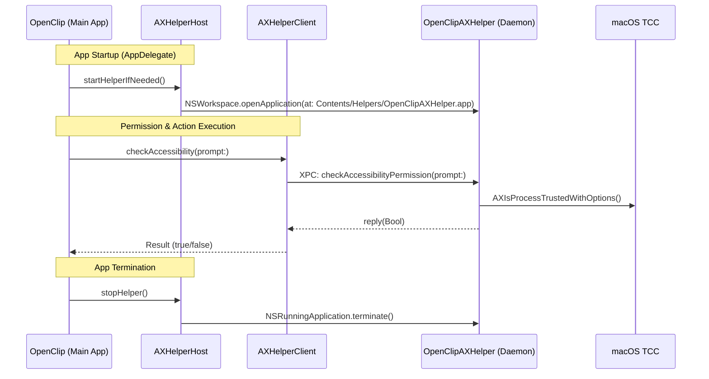

# Immutable Accessibility Helper Architecture

OpenClip utilizes the **Immutable Accessibility Helper** pattern (`OpenClipAXHelper`) to ensure reliable, permanent macOS Accessibility permissions across application updates, auto-updates (Sparkle), and reinstalls without requiring an Apple Developer ID certificate.

---

## 1. The TCC Permission Invalidation Problem

On macOS, Accessibility permissions are managed by the Transparency, Consent, and Control (TCC) subsystem (`tccd`). For applications distributed ad-hoc (without a paid Apple Developer ID certificate), TCC binds permissions to the **Code Directory Hash (`cdhash`)** and bundle identifier of the binary.

When an ad-hoc signed application updates its executable:
1. The binary code changes.
2. The `cdhash` changes.
3. macOS TCC detects that the binary no longer matches the previously authorized hash.
4. macOS revokes or invalidates the permission entry, requiring the user to re-grant Accessibility permissions in System Settings on every single update.

---

## 2. The Solution: Immutable Helper Pattern

To resolve this permanently, OpenClip decouples Accessibility API calls from the rapidly changing main application into a dedicated, minimal, zero-dependency background daemon: **`OpenClipAXHelper.app`**.

```
OpenClip.app (UI, Extensions, AI, Rapid Releases)
└── Contents/Helpers/
    └── OpenClipAXHelper.app (Immutable Daemon: Only Accessibility APIs + IPC)
         └── Granted TCC Accessibility Permission (Preserved permanently across updates)
```

### Why it works
- **Minimal Surface**: The helper contains *only* Accessibility queries (`AXIsProcessTrustedWithOptions`, `AXUIElementCopyAttributeValue`), simulated key events (`CGEventPost`), and XPC IPC endpoints.
- **Unchanging Binary (`cdhash`)**: Because no UI, extensions, or feature code lives in the helper, its source code and compiled binary remain byte-for-byte identical across normal OpenClip releases.
- **Persistent Permission**: When the user grants Accessibility permission to `OpenClipAXHelper`, macOS TCC retains this permission indefinitely across all updates to `OpenClip.app`.

---

## 3. Architecture & Components



### Subsystems Breakdown

| Subsystem | Location | Role |
|---|---|---|
| **Core Protocol & Models** | [`Sources/Core/Helper/`](../../Sources/Core/Helper/) | Pure Swift IPC protocols (`AXHelperServiceProtocol`, `AXHelperConstants`) and Codable payload models (`AXSelectionPayload`, `AXKeyCommandPayload`). Pure domain target with zero AppKit/UI dependencies. |
| **Daemon Implementation** | [`Sources/OpenClipHelper/`](../../Sources/OpenClipHelper/) | Mach service listener (`main.swift`) and service dispatcher (`AXHelperService.swift`). Configured with `LSUIElement: true` and `LSBackgroundOnly: true` (runs headlessly with no Dock icon or menu bar items). |
| **Client Bridge** | [`Sources/OpenClip/Platform/Helper/AXHelperClient.swift`](../../Sources/OpenClip/Platform/Helper/AXHelperClient.swift) | Manages `NSXPCConnection` to `com.openclip.OpenClip.helper`. Wraps asynchronous completions with `OnceResume` for thread-safe exactly-once resumption. Falls back to local in-process calls if disconnected. |
| **Process Supervisor** | [`Sources/OpenClip/Platform/Helper/AXHelperHost.swift`](../../Sources/OpenClip/Platform/Helper/AXHelperHost.swift) | Lifecycle manager invoked by `AppDelegate`. Resolves helper bundle from `Contents/Helpers/OpenClipAXHelper.app`, launches it in background if not running, and terminates it cleanly on app shutdown. |

---

## 4. Headless & Standalone Fallback

The architecture includes automatic fallback:
- When running in unit tests or CLI environments where the helper bundle is not packaged, `AXHelperClient` and `PermissionManager` detect connection failure and transparently fallback to in-process `AXIsProcessTrustedWithOptions` without hanging, crashing, or blocking the main thread.

---

## 5. Build, Signing & Packaging Pipeline

The packaging workflow in [`scripts/package_app.sh`](../../scripts/package_app.sh) enforces Apple's nested bundle code-signing rules (inside-out signing):
1. Builds `OpenClipAXHelper` in Release mode (`generic/platform=macOS`, `ARCHS='arm64 x86_64'`).
2. Builds `OpenClip` in Release mode.
3. Copies `OpenClipAXHelper.app` into `OpenClip.app/Contents/Helpers/`.
4. Signs the nested `OpenClipAXHelper.app` bundle first (`codesign --force --deep --sign -`).
5. Signs the parent `OpenClip.app` bundle second (`codesign --force --deep --sign -`).
6. Verifies both signatures strictly with `codesign --verify --deep --strict`.
7. Packages into `build/OpenClip.zip` and `build/OpenClip.dmg`.
