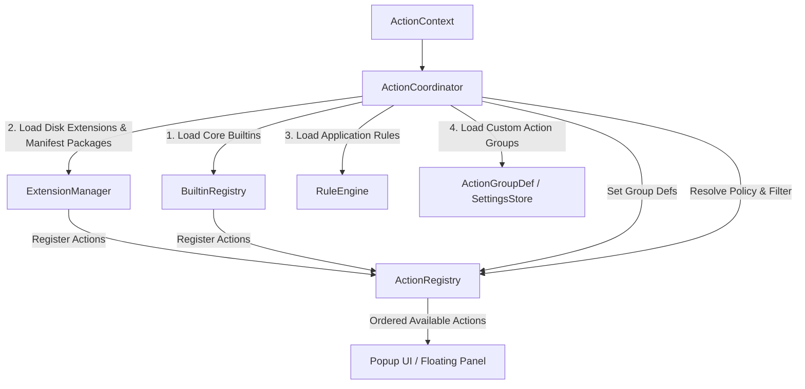

# Action Coordinator & Registry Architecture

The [`ActionCoordinator`](../../Sources/Core/Actions/ActionCoordinator.swift) serves as the **Action Coordinator & Composition** of OpenClip. It bridges domain managers (`ExtensionManager`, `RuleEngine`) with the central [`ActionRegistry`](../../Sources/Core/Actions/ActionRegistry.swift) catalog, resolving available actions based on user configuration, current text selection, and active application policy rules.

---

## Architectural Responsibilities



1. **Composition Seam**: Initializes domain registries during `loadInitialState()`.
2. **Catalog Storage**: Delegates raw action storage and sorting to `ActionRegistry`.
3. **Policy Context**: App policies are resolved by the trigger sites (`RuleEngine.resolvePolicies`) and attached to the selection context; delivery re-reads them from the snapshot (paste-vs-copy).
4. **Action Reordering**: Exposes reordering primitives (`moveActions(from:to:)`) that mutate user preferences stored via `SettingsStore`.
5. **Custom Action Groups Lifecycle**: Manages user-defined group CRUD operations, orphan pruning, and synchronization with `ActionRegistry`.

---

## Action Registration Mechanics

> **Current reality (2026-08):** the `onRegister`/`onUnregister` callback seam described below is implemented. `ActionCoordinator.loadInitialState()` wires `ExtensionManager` to the registry via those callbacks; the manager never calls `ActionRegistry.shared` directly. GUI-authored custom actions are single-action manifest packages (written by `CustomActionManifestWriter`) and load through the same extension scan — `custom_actions.json`/`CustomActionManager` are retired.

### Initial Loading Lifecycle

```swift
@MainActor
public func loadInitialState(
    extensionsDirectory: URL = Constants.extensionsDirectory,
    rulesURL: URL = Constants.rulesFileURL,
    dictionaryLookup: @escaping @Sendable (String) -> String? = { _ in nil }
) async {
    // 1. Register Core Builtin Actions (Copy, Cut, Paste, Define, Search, Calculate)
    let coreBuiltins = BuiltinRegistry.makeCoreBuiltins(
        settingsStore: settingsStore,
        dictionaryLookup: dictionaryLookup
    )
    registry.register(builtIns: coreBuiltins)

    // 2. Load application rules and scan installed extensions (manifests, standalone scripts, snippets)
    await ruleEngine.loadRules(from: rulesURL)
    await extensionManager.loadExtensions(from: extensionsDirectory)

    // 3. Load custom action groups
    loadGroupDefs()
}
```

### Registration & Unregistration
When extension packages are added, updated, or removed:
- `ExtensionManager.loadExtensions()` unregisters previous extension actions and reports newly discovered ones through the `onRegister`/`onUnregister` callbacks (wired to the registry by `ActionCoordinator.loadInitialState()`).
- Custom action group definitions (`ActionGroupDef`) in `SettingsStore` persist across extension unregistrations, reloads, and updates. Absent members are dynamically filtered out at runtime by `CustomGroupAction.subActions(in:)` without mutating the saved user configuration.
- Neither Core domain manager touches `ActionRegistry.shared` directly; `ActionCoordinator` is the only type that does.

---

## Action Registry & Ordering Policy

The [`ActionRegistry`](../../Sources/Core/Actions/ActionRegistry.swift) is responsible for maintaining the in-memory array of registered actions and enforcing sorting order based on user preferences.

### Dynamic Ordering Math & Custom Groups

Actions are stored in an internal `@Published` array. Whenever new actions are registered or group definitions change, `sortActions()` evaluates their index against the user's saved preference array (`SettingKey.actionOrder`) using a three-tier ranking:
1. **Tier 0**: Actions explicitly ordered by the user in `SettingKey.actionOrder`.
2. **Tier 1**: Unordered built-in actions (stable insertion order).
3. **Tier 2**: Unordered extensions and other actions (stable insertion order).

When `ActionGroupDef`s are present, `ActionRegistry` injects a synthetic `CustomGroupAction` header followed contiguously by all of its member actions (in their sorted relative order) upon the first member encounter in the base sort.

Group members maintain their **canonical IDs** (e.g. `builtin.copy`, `com.user.ext.action`) without virtual ID prefixing (`vgroup.<id>.<actionID>`).

When users drag to reorder actions in the Preferences UI, `moveActions(from:to:)` re-arranges the items in memory and immediately persists the updated list of action identifiers to `SettingsStore`, filtering out AI presets and synthetic `CustomGroupAction` headers so `actionOrder` only tracks canonical action IDs:

```swift
public func moveActions(from source: IndexSet, to destination: Int) {
    // Reorder in-memory list ...
    let newOrder = actions
        .filter { !ActionIdentity.isAIPreset($0) && !($0 is CustomGroupAction) }
        .map { $0.id }
    settingsStore.set(.actionOrder, value: newOrder)
}
```

---

## Custom Action Groups & Lifecycle

Custom action groups allow users to bundle multiple actions under a single expandable popup row.

### Core Domain Models

- **`ActionGroupDef`** (`Sources/Core/Actions/ActionGroupDef.swift`): Pure Codable model representing the persistent definition (`id`, `title`, `iconName`, `memberActionIDs`), stored as JSON in `SettingKey.actionGroups`.
- **`CustomGroupAction`** (`Sources/Core/Actions/CustomGroupAction.swift`): Pure domain action conforming to `Action` and `SubActionProviding`. It defines `popupBehavior = .showSubActions` and dynamically resolves its sub-actions from the catalog by matching canonical IDs in `memberActionIDs`.

### Strict $\ge 2$ Member Invariant

Every custom action group must contain at least 2 distinct member actions. The invariant is strictly enforced:
- Group creation (`createGroup`) rejects payloads with fewer than 2 valid IDs.
- Group updates (`updateGroup`) dissolve the group (`ungroup`) if members fall below 2.
- Member removal (`removeFromGroup` or extension unregistration cascade) automatically deletes the group if remaining members $< 2$.
- Boot-time orphan pruning (`pruneOrphans`) drops nonexistent action IDs and discards any group with $< 2$ active members.

---

## Action Availability & Context Resolution

When selected text is detected, `ActionCoordinator.resolveActions(for:)` converts the raw [`SelectionContext`](../../Sources/Core/Selection/SelectionContext.swift) into an evaluated context using `RuleEngine.resolvePolicies(for:)`.

### Filtering Pipeline

`ActionRegistry.availableActions(for:)` applies multiple policy filters before returning actions to the UI:

1. **Disabled Actions Check**:
 - Queries `SettingKey.disabledActionIDs` from `SettingsStore`.

2. **Disabled Package Check**:
 - Queries `SettingKey.disabledPackages` from `SettingsStore`. Any action whose `action.chrome.source` is `.extensionPkg(packageID:)` with a disabled packageID is filtered out (whole-package disable).

3. **Action Capability Check**:
 - Evaluates `canPerform(action, in: context)`. Script actions check for non-empty text, URL templates evaluate optional regex pattern matches, and clipboard-fallback selections require live selection capabilities.

4. **Group Member Visibility Check**:
 - **Extension Groups**: Sub-actions whose IDs match an extension group prefix (`<groupID>.<subID>`) are hidden if the parent group is disabled or filtered out.
 - **Custom Groups**: Member actions mapped via `customGroupMemberToGroupID` are hidden if their parent `CustomGroupAction` is disabled or filtered out.

```swift
public func availableActions(for context: ActionContext) -> [any Action] {
    let disabledIDs = settingsStore.get(.disabledActionIDs)
    let disabledPackages = settingsStore.get(.disabledPackages)

    func passes(_ action: any Action) -> Bool {
        if ActionIdentity.isAIPreset(action) { return false }
        if action is GatedExtensionAction { return false }
        guard canPerform(action, in: context) else { return false }
        if disabledIDs.contains(action.id) { return false }
        if let packageID = ActionIdentity.extensionPackageID(of: action), disabledPackages.contains(packageID) {
            return false
        }
        return true
    }

    // Group sub-actions are only reachable through their group's sub-menu. A group whose
    // row is disabled (or otherwise not visible) hides its sub-actions entirely, so a
    // disabled group never leaks its sub-actions into the bar.
    let groupRowIDs = actions
        .filter { $0.chrome.popupBehavior == .showSubActions }
        .map { $0.id }
    let enabledGroupIDs = Set(
        actions
            .filter { $0.chrome.popupBehavior == .showSubActions }
            .filter { passes($0) }
            .map { $0.id }
    )

    // Custom groups: hide members of a disabled custom group.
    // This parallels the prefix-based hiding above but uses the explicit
    // memberActionIDs list since custom group members keep canonical IDs.
    let customGroupMemberToGroupID: [String: String] = {
        var map: [String: String] = [:]
        for def in groupDefs {
            for memberID in def.memberActionIDs {
                map[memberID] = def.id
            }
        }
        return map
    }()

    return actions.filter { action in
        guard passes(action) else { return false }
        if let groupID = groupRowIDs.first(where: { action.id.hasPrefix($0 + ".") }),
           !enabledGroupIDs.contains(groupID) {
            return false
        }
        if let owningGroupID = customGroupMemberToGroupID[action.id],
           !enabledGroupIDs.contains(owningGroupID) {
            return false
        }
        return true
    }
}
```
