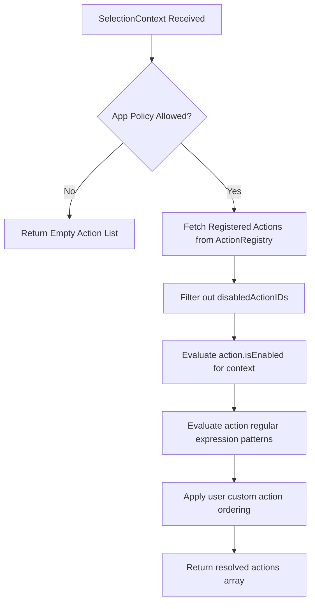

# Action Coordinator & Registry

The **Action Coordinator** (`ActionCoordinator.swift`) and **Action Registry** (`ActionRegistry.swift`) form the core execution engine of OpenClip.

---

## Action Protocols

All actions in OpenClip conform to the `Action` Swift protocol:

```swift
public protocol Action: Sendable {
    var id: String { get }
    var title: String { get }
    var icon: ActionIcon { get }
    
    @MainActor
    func isEnabled(for context: ActionContext) -> Bool
    
    @MainActor
    func perform(_ context: ActionContext) async throws -> ActionResult
}
```

Configurable actions conform to `ConfigurableAction`:

```swift
public protocol ConfigurableAction: Action {
    var configurationViewID: String { get }
    var preferenceIconName: String { get }
}
```

---

## Action Resolution Pipeline

When a `SelectionContext` is passed to `ActionCoordinator.resolveActions(for:)`:



1. **Policy Verification:** Check if `sourceApp` is disabled in App Rules.
2. **Disabled IDs Filtering:** Omit any action IDs listed in `UserDefaults.disabledActionIDs`.
3. **Contextual Evaluation:** Call `action.isEnabled(for: context)`. For example, `CalculateAction` only enables if selection contains mathematical expressions (`2 + 2`).
4. **Regular Expression Matching:** Check if action defines a regex pattern matching `context.selection.text`.
5. **Ordering & Presenting:** Sort active actions based on user's custom layout order in Preferences.
