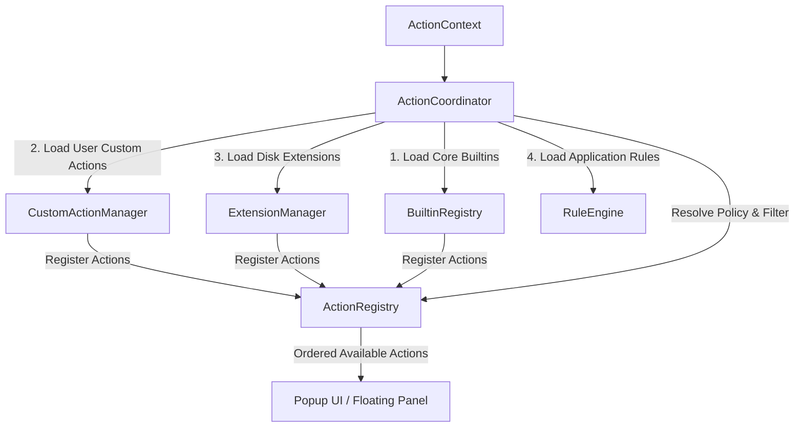

# Action Coordinator & Registry Architecture

The [`ActionCoordinator`](../../Sources/Core/Actions/ActionCoordinator.swift) serves as the **Action Coordinator & Composition** of OpenClip. It bridges domain managers (`CustomActionManager`, `ExtensionManager`, `RuleEngine`) with the central [`ActionRegistry`](../../Sources/Core/Actions/ActionRegistry.swift) catalog, resolving available actions based on user configuration, current text selection, and active application policy rules.

---

## Architectural Responsibilities



1. **Composition Seam**: Initializes domain registries during `loadInitialState()`.
2. **Catalog Storage**: Delegates raw action storage and sorting to `ActionRegistry`.
3. **Policy Context Resolution**: Evaluates context bundle identifiers through `RuleEngine` to produce updated `ActionContext` options (`denyFormatting`, `assumePaste`, `grabPasteboard`).
4. **Action Reordering**: Exposes reordering primitives (`moveActions(from:to:)`) that mutate user preferences stored via `SettingsStore`.

---

## Action Registration Mechanics

> **Current reality (2026-08):** the `onRegister`/`onUnregister` callback seam described below is implemented. `ActionCoordinator.loadInitialState()` wires `CustomActionManager` and `ExtensionManager` to the registry via those callbacks; neither manager calls `ActionRegistry.shared` directly.

### Initial Loading Lifecycle

```swift
@MainActor
public func loadInitialState() async {
 // 1. Register Core Builtin Actions (Copy, Cut, Paste, Define, Search, Transform)
 let coreBuiltins = BuiltinRegistry.makeCoreBuiltins()
 registry.register(builtIns: coreBuiltins)

 // 2. Load custom user actions from disk repository
 CustomActionManager.shared.load()

 // 3. Load application rules and scan installed extensions
 await ruleEngine.loadRules(from: Constants.rulesFileURL)
 await extensionManager.loadExtensions()
}
```

### Registration & Unregistration
When custom actions or extension packages are added, updated, or removed:
- `CustomActionManager.register(customAction:)` inserts the item into `customActions` and reports it via its `onRegister` callback (wired to the registry by `ActionCoordinator.loadInitialState()`).
- `ExtensionManager.loadExtensions()` unregisters previous extension actions and reports newly discovered ones through the same `onRegister`/`onUnregister` callbacks.
- Neither Core domain manager touches `ActionRegistry.shared` directly; `ActionCoordinator` is the only type that does.

---

## Action Registry & Ordering Policy

The [`ActionRegistry`](../../Sources/Core/Actions/ActionRegistry.swift) is responsible for maintaining the in-memory array of registered actions and enforcing sorting order based on user preferences.

### Dynamic Ordering Math

Actions are stored in an internal `@Published` array. Whenever new actions are registered, `sortActions()` evaluates their index against the user's saved preference array (`SettingKey.actionOrder`):

```swift
private func sortActions() {
 let order = settingsStore.get(.actionOrder)
 actions.sort { a, b in
 let idxA = order.firstIndex(of: a.id) ?? Int.max
 let idxB = order.firstIndex(of: b.id) ?? Int.max
 if idxA == Int.max && idxB == Int.max {
 return false // Preserve relative insertion order
 }
 return idxA < idxB
 }
}
```

When users drag to reorder actions in the Preferences UI, `moveActions(from:to:)` re-arranges the items in memory and immediately persists the updated list of action identifiers to `SettingsStore`:

```swift
public func moveActions(from source: IndexSet, to destination: Int) {
 // Reorder in-memory list
 // ...
 let newOrder = actions.map { $0.id }
 settingsStore.set(.actionOrder, value: newOrder)
}
```

---

## Action Availability & Context Resolution

When selected text is detected, `ActionCoordinator.resolveActions(for:)` converts the raw [`SelectionContext`](../../Sources/Core/Selection/SelectionContext.swift) into an evaluated context using `RuleEngine.resolvePolicies(for:)`.

### Filtering Pipeline

`ActionRegistry.availableActions(for:)` applies multiple policy filters before returning actions to the UI:

1. **Disabled Actions Check**:
 - Queries `SettingKey.disabledActionIDs` from `SettingsStore`.
 - Evaluates `SettingKey.isTransformGroupEnabled`. If `isTransformGroupEnabled` is `false`, `"builtin.transform"` is added to disabled IDs.
 - Applies the default disabled transform cases from `TransformCase.defaultDisabledActionIDs`.

2. **Formatting Policy Check**:
 - If `context.selection.appPolicy.denyFormatting` is `true` (e.g. Terminal, IDEs), actions with `action.isFormatting == true` are filtered out.

3. **Action Capability Check**:
 - Evaluates `action.isEnabled(for: context)`. For instance, script actions check for non-empty text, while URL template actions evaluate optional regex pattern matches (`regexPattern`).

```swift
public func availableActions(for context: ActionContext) -> [any Action] {
 let defaultDisabledSubActions = TransformCase.defaultDisabledActionIDs

 let configuredDisabled = settingsStore.get(.disabledActionIDs)
 var disabledIDs = configuredDisabled.isEmpty ? Set(defaultDisabledSubActions) : configuredDisabled
 if !settingsStore.get(.isTransformGroupEnabled) {
 disabledIDs.insert("builtin.transform")
 }

 return actions.filter { action in
 if disabledIDs.contains(action.id) { return false }
 if context.selection.appPolicy.denyFormatting && action.isFormatting { return false }
 return action.isEnabled(for: context)
 }
}
```
