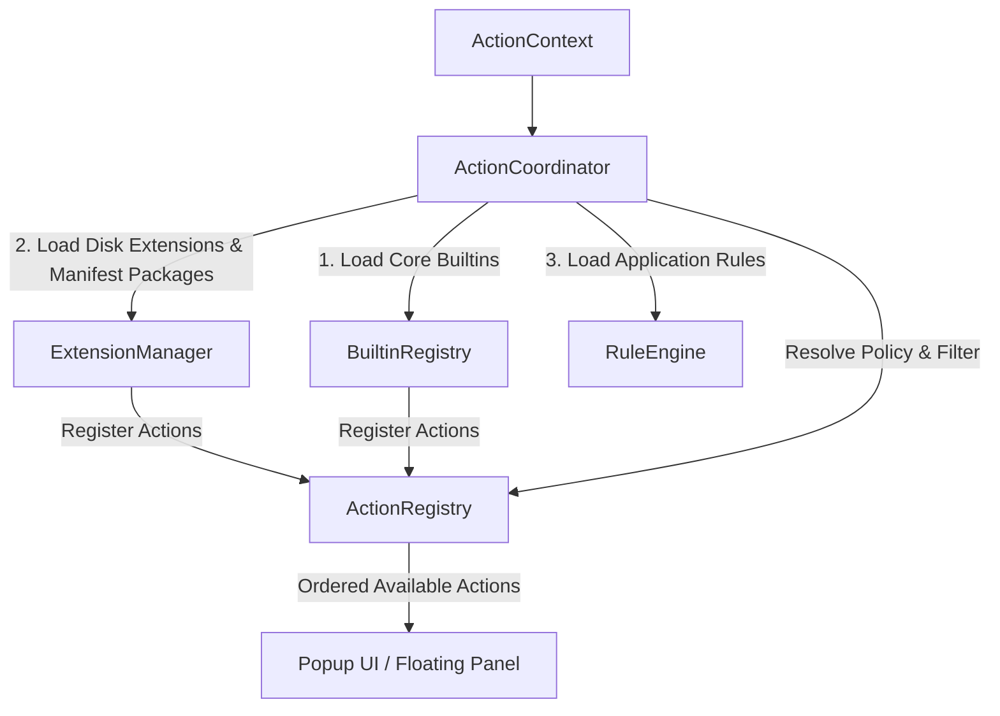

# Action Coordinator & Registry Architecture

The [`ActionCoordinator`](../../Sources/Core/Actions/ActionCoordinator.swift) serves as the **Action Coordinator & Composition** of OpenClip. It bridges domain managers (`ExtensionManager`, `RuleEngine`) with the central [`ActionRegistry`](../../Sources/Core/Actions/ActionRegistry.swift) catalog, resolving available actions based on user configuration, current text selection, and active application policy rules.

---

## Architectural Responsibilities



1. **Composition Seam**: Initializes domain registries during `loadInitialState()`.
2. **Catalog Storage**: Delegates raw action storage and sorting to `ActionRegistry`.
3. **Policy Context Resolution**: Evaluates context bundle identifiers through `RuleEngine` to produce updated `ActionContext` options (`denyFormatting`, `assumePaste`, `grabPasteboard`).
4. **Action Reordering**: Exposes reordering primitives (`moveActions(from:to:)`) that mutate user preferences stored via `SettingsStore`.

---

## Action Registration Mechanics

> **Current reality (2026-08):** the `onRegister`/`onUnregister` callback seam described below is implemented. `ActionCoordinator.loadInitialState()` wires `ExtensionManager` to the registry via those callbacks; the manager never calls `ActionRegistry.shared` directly. GUI-authored custom actions are single-action manifest packages (written by `CustomActionManifestWriter`) and load through the same extension scan — `custom_actions.json`/`CustomActionManager` are retired.

### Initial Loading Lifecycle

```swift
@MainActor
public func loadInitialState() async {
 // 1. Register Core Builtin Actions (Copy, Cut, Paste, Define, Search, Calculate)
 let coreBuiltins = BuiltinRegistry.makeCoreBuiltins()
 registry.register(builtIns: coreBuiltins)

 // 2. Load application rules and scan installed extensions (manifests, standalone scripts, snippets)
 await ruleEngine.loadRules(from: Constants.rulesFileURL)
 await extensionManager.loadExtensions()
}
```

### Registration & Unregistration
When extension packages are added, updated, or removed:
- `ExtensionManager.loadExtensions()` unregisters previous extension actions and reports newly discovered ones through the `onRegister`/`onUnregister` callbacks (wired to the registry by `ActionCoordinator.loadInitialState()`).
- Neither Core domain manager touches `ActionRegistry.shared` directly; `ActionCoordinator` is the only type that does.

---

## Action Registry & Ordering Policy

The [`ActionRegistry`](../../Sources/Core/Actions/ActionRegistry.swift) is responsible for maintaining the in-memory array of registered actions and enforcing sorting order based on user preferences.

### Dynamic Ordering Math

Actions are stored in an internal `@Published` array. Whenever new actions are registered, `sortActions()` evaluates their index against the user's saved preference array (`SettingKey.actionOrder`):

```swift
private func sortActions() {
 let order = settingsStore.get(.actionOrder)
 actions.sort { a, b in
 let idxA = order.firstIndex(of: a.id) ?? Int.max
 let idxB = order.firstIndex(of: b.id) ?? Int.max
 if idxA == Int.max && idxB == Int.max {
 return false // Preserve relative insertion order
 }
 return idxA < idxB
 }
}
```

When users drag to reorder actions in the Preferences UI, `moveActions(from:to:)` re-arranges the items in memory and immediately persists the updated list of action identifiers to `SettingsStore`:

```swift
public func moveActions(from source: IndexSet, to destination: Int) {
 // Reorder in-memory list
 // ...
 let newOrder = actions.map { $0.id }
 settingsStore.set(.actionOrder, value: newOrder)
}
```

---

## Action Availability & Context Resolution

When selected text is detected, `ActionCoordinator.resolveActions(for:)` converts the raw [`SelectionContext`](../../Sources/Core/Selection/SelectionContext.swift) into an evaluated context using `RuleEngine.resolvePolicies(for:)`.

### Filtering Pipeline

`ActionRegistry.availableActions(for:)` applies multiple policy filters before returning actions to the UI:

1. **Disabled Actions Check**:
 - Queries `SettingKey.disabledActionIDs` from `SettingsStore`.

2. **Disabled Package Check**:
 - Queries `SettingKey.disabledPackages` from `SettingsStore`. Any action whose `action.chrome.source` is `.extensionPkg(packageID:)` with a disabled packageID is filtered out (whole-package disable).

3. **Formatting Policy Check**:
 - If `context.selection.appPolicy.denyFormatting` is `true` (e.g. Terminal, IDEs), actions with `action.isFormatting == true` are filtered out.

4. **Action Capability Check**:
 - Evaluates `action.isEnabled(for: context)`. For instance, script actions check for non-empty text, while URL template actions evaluate optional regex pattern matches (`regexPattern`). Extension actions built by `DefaultActionFactory` carry `ExtensionActionRules` and delegate to `rules.resolveVisibility(for:)`, which also applies a manifest `requirements.expression` computed-visibility gate (a pure-Swift `ValidateExpression` DSL compiled once at load) after the regex first pass.

```swift
public func availableActions(for context: ActionContext) -> [any Action] {
 let disabledIDs = settingsStore.get(.disabledActionIDs)
 let disabledPackages = settingsStore.get(.disabledPackages)

 func passes(_ action: any Action) -> Bool {
  if case .ai = action.chrome.source { return false }        // AI presets never flood the bar
  if context.selection.isClipboardFallback && action.chrome.requiresLiveSelection { return false }
  if disabledIDs.contains(action.id) { return false }
  if case .extensionPkg(let packageID) = action.chrome.source, disabledPackages.contains(packageID) { return false }
  if context.selection.appPolicy.denyFormatting && action.isFormatting { return false }
  return action.isEnabled(for: context)
 }

 // Group sub-actions are reachable only through their group's sub-menu, so a disabled
 // (or otherwise not-visible) group row hides its sub-actions entirely.
 let groupRowIDs = actions.filter { $0.chrome.popupBehavior == .showSubActions }.map { $0.id }
 let enabledGroupIDs = Set(
  actions.filter { $0.chrome.popupBehavior == .showSubActions }.filter(passes).map { $0.id }
 )
 return actions.filter { action in
  guard passes(action) else { return false }
  if let groupID = groupRowIDs.first(where: { action.id.hasPrefix($0 + ".") }),
     !enabledGroupIDs.contains(groupID) { return false }
  return true
 }
}
```
