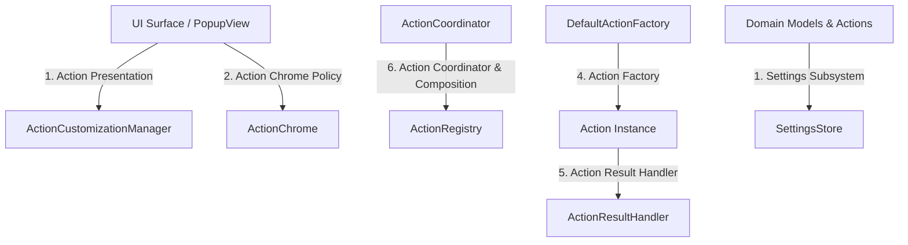

# Architecture Overview

OpenClip is engineered around a clean target split and single-responsibility architectural boundaries ("Architectural Subsystems"). This design guarantees strict separation between pure domain logic, platform-specific side-effects, dynamic action runtimes, and user interface components.

---

## Target Split

The codebase is split into three targets:

```
OpenClip Workspace
├── Core (Framework / Swift Package)
│ ├── Pure domain models (Action, ActionChrome, ActionResult, SelectionContext)
│ ├── Selection detection contracts (TextRetrieving, SelectionMonitoring)
│ ├── Helper IPC protocols & payload models (AXHelperProtocol, AXHelperModels)
│ ├── Central action catalog & ordering (ActionRegistry, ActionCoordinator)
│ ├── Action-search matcher & popup mode (ActionSearch)
│ ├── Strongly-typed settings engine (SettingsStore, SettingKey)
│ ├── Application policy rules (AppRule, RuleEngine)
│ └── Pure snippet & manifest parsing (OpenClipSnippetParser, ExtensionManifest)
│
├── OpenClipAXHelper (Immutable Background Daemon Target)
│ ├── Standalone Accessibility APIs & CGEvent injection (AXHelperService)
│ ├── Mach XPC service listener & lifecycle (main.swift)
│ └── Zero UI / Zero AppKit dependencies (LSUIElement: true, LSBackgroundOnly: true)
│
└── OpenClip (macOS Application Target)
  ├── AppKit floating panels & SwiftUI UI (PopupPanel, PopupView, PreferencesView)
  ├── Action execution runtimes (JavaScriptAction, AppleScriptAction)
  ├── Platform side-effect handler (ActionResultHandler)
  ├── Action factory implementation (DefaultActionFactory)
  ├── Helper client bridge & lifecycle host (AXHelperClient, AXHelperHost)
  ├── macOS selection monitoring & retrieval (MacSelectionMonitor, SelectionRetrievalCoordinator + strategies)
  └── App Composition Root (AppDelegate)
```

### Core Target Constraints
- **Zero AppKit / SwiftUI UI dependencies** in `Sources/Core/Actions/` or `Sources/Core/Settings/`.
- **Pure Swift Types**: Value types, protocols, and decoupled services.
- **Dependency Injection**: Core components requiring settings accept a `SettingsStore` instance
  during initialization (defaulting to `DefaultSettingsStore.shared`). Builtin actions
  (`SearchAction`, `CalendarAction`, `CalculateAction`) take the store via
  `BuiltinRegistry.makeCoreBuiltins(settingsStore:)`; `ActionCoordinator` takes
  `registry`/`ruleEngine`/`extensionManager`/`settingsStore` in `init` (default `.shared`).
  Display title/icon resolution goes through an injected `ActionPresenting`, never a hidden
  singleton inside the `Action` protocol extension.

---

## Core Architectural Subsystems

OpenClip enforces a single entry point for each cross-cutting concern. Bypassing these single-responsibility interfaces is strictly prohibited.



### 1. Settings Subsystem — [`SettingsStore`](../../Sources/Core/Settings/SettingsStore.swift)
- **Responsibility**: Centralized persistence and retrieval of application settings.
- **Mechanism**: Operates via strongly-typed [`SettingKey<T>`](../../Sources/Core/Settings/SettingKey.swift) instances.
- **Strict Rule**: Zero direct `UserDefaults.standard` calls anywhere in `Sources/`. All access goes through `SettingsStore` in Core via dependency injection or `DefaultSettingsStore.shared` in the App target. (The only remaining raw access is the one-time `aiCloudAPIKey` migration in `AIServiceManager` — read-then-delete; the AI-config/theme `@AppStorage` surface remains too. Migrating is ongoing — do not add new direct call sites.) Secrets (e.g. the cloud AI API key) live in the Keychain via `KeychainStore`, never UserDefaults.

### 2. Action Presentation — [`ActionCustomizationManager`](../../Sources/Core/Actions/ActionCustomizationManager.swift)
- **Responsibility**: Resolves display titles and icons for specific UI surfaces (`.popup` or `.table`).
- **Mechanism**: `ActionCustomizationManager.presented(action, surface:)` queries user customizations and falls back to action defaults; `ActionPresentationModel` carries the resolved title/icon.
- **Strict Rule**: UI code never computes display icons using type checks or string matches. Preferences table icons delegate to `ConfigurableAction.preferenceIconName`.

### 3. Action Chrome Policy — [`ActionChrome`](../../Sources/Core/Actions/ActionChrome.swift)
- **Responsibility**: Exposes UI policy metadata for actions without logic coupling.
- **Metadata**:
 - `badge`: `.none`, `.script`, `.url`, `.custom`, `.extensionPkg(String)`
 - `rowStyle`: `.standard`, `.actionGroup`
 - `popupBehavior`: `.perform`, `.showSubActions`, `.provideCompletions`
 - `source`: `.builtin`, `.custom`, `.extensionPkg(packageID: String)`
- **Strict Rule**: Views must inspect `action.chrome.badge` or `action.chrome.source` instead of checking `if action is ScriptAction` or matching `action.id`.

### 4. Action Factory — [`DefaultActionFactory`](../../Sources/OpenClip/Platform/Extensions/DefaultActionFactory.swift)
- **Responsibility**: Instantiating executable `Action` objects from extension manifest JSON metadata or parsed script snippet headers.
- **Mechanism**: Implements the `ActionFactory` protocol in the App target where JavaScript, AppleScript, and process runtimes are available.

### 5. Action Result Handler — [`ActionResultHandler`](../../Sources/OpenClip/Platform/Effects/ActionResultHandler.swift)
- **Responsibility**: Executing platform side-effects returned by actions (such as copying text, pasting into active apps, opening URLs, or showing system sharing services).
- **Strict Rule**: `PopupWindowController` manages window presentation and event filtering, delegating all result execution side-effects to `ActionResultHandler`.

### 6. Action Coordinator & Composition — [`ActionCoordinator`](../../Sources/Core/Actions/ActionCoordinator.swift)
- **Responsibility**: Orchestrates initial state loading, registers builtins, and connects disk extensions (including GUI-authored manifest packages) to the central `ActionRegistry`.
- **Strict Rule**: `ExtensionManager` does not couple directly to the registry; it reports changes through `onRegister`/`onUnregister` callbacks wired by `ActionCoordinator.loadInitialState()`.
- **Search catalog**: `ActionCoordinator.searchCatalog` (→ `ActionRegistry.searchCatalog`) exposes the **full** registered catalog — enabled and disabled, no context/visibility filtering — for the popup's action-search palette; [`ActionSearch.search`](../../Sources/Core/Actions/ActionSearch.swift) ranks it.

### 7. Immutable Accessibility Helper Subsystem — [`OpenClipAXHelper`](accessibility-helper.md)
- **Responsibility**: Isolates macOS Accessibility queries and keystroke simulation into a dedicated background daemon embedded at `OpenClip.app/Contents/Helpers/OpenClipAXHelper.app`.
- **Mechanism**: Communicates via Mach service XPC (`AXHelperServiceProtocol`, [`AXHelperClient`](../../Sources/OpenClip/Platform/Helper/AXHelperClient.swift)). Supervised by [`AXHelperHost`](../../Sources/OpenClip/Platform/Helper/AXHelperHost.swift).
- **TCC Stability Rule**: Preserves macOS TCC Accessibility permissions across Sparkle updates and ad-hoc reinstalls because the helper's code directory hash (`cdhash`) remains byte-for-byte stable.

---

## Key Design Guidelines

1. **Accept dependencies, don't create them**: Core types accept `SettingsStore` in `init(settingsStore:)` with default fallback (see §1 above); `ActionCoordinator` and the builtin builder take their collaborators in `init`.
2. **No `ActionRegistry.shared` inside domain managers**: Domain managers report registration changes through `onRegister`/`onUnregister` callbacks wired by `ActionCoordinator`. Only `ActionCoordinator` touches the registry directly.
3. **No `switch action.id` string matching in UI**: Display formatting relies on `ConfigurableAction.preferenceIconName` and `ActionChrome`. (One legacy `switch action.id` block remains in `ActionCustomizationManager.tableIcon`.)
4. **Pure Snippet Parsing**: `OpenClipSnippetParser` is a pure string parser with no UI or `@MainActor` ties. (Note: it is currently annotated `@MainActor`.)
5. **Pure Layout Math**: `PopupPositioner` is a pure static struct for computing panel coordinates and edge clamping.
6. **Static previews don't share live state**: `PopupPreview` hardcodes a canonical action set and passes its own `PopupHoverState()` + `isStatic: true` to `PopupView`, so it never reflects — or leaks hover into — the real popup.
7. **Standard windows unless a chrome-less card is the goal**: Preferences uses standard window chrome (`hiddenTitleBar`/`fullSizeContentView`) with `.glassSurface` content; onboarding is a `.borderless` transparent window that re-draws the card, border, and shadow manually.
