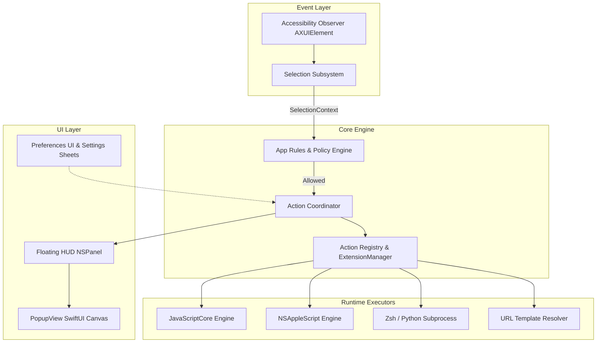

# System Architecture: Overview

OpenClip is engineered as a modular, lightweight macOS application using Swift and SwiftUI. The codebase is organized into `Core` framework logic and `OpenClip` host application UI.

---

## Architectural Principles

1. **Clean Separation of Concerns:** Core action contracts, selection context extraction, and extension loading reside in `Sources/Core`. UI presentation, popup window lifecycle, and preference views reside in `Sources/OpenClip`.
2. **Event-Driven Execution:** OpenClip monitors macOS text selection events asynchronously using low-overhead Accessibility observation APIs.
3. **Extensibility First:** Every built-in action (Copy, Cut, Paste, Define, Search, Transform) implements the same `Action` Swift protocol as third-party extensions.

---

## High-Level Subsystem Diagram

---

## Core Source Directories

| Path | Purpose |
|------|---------|
| `Sources/Core/Actions/` | Protocol definitions (`Action`, `ConfigurableAction`), `ActionContext`, `ActionRegistry`, `ActionCoordinator`. |
| `Sources/Core/Actions/Builtin/` | Implementations of native actions: `CopyAction`, `CutAction`, `PasteAction`, `DefineAction`, `CalculateAction`, `SearchAction`, `TransformTextAction`. |
| `Sources/Core/Extensions/` | `ExtensionManager`, `ScriptAction`, `OpenClipSnippetParser`. |
| `Sources/OpenClip/Actions/` | `JavaScriptAction` (JSC) and `AppleScriptAction`. |
| `Sources/OpenClip/UI/Popup/` | `PopupWindowController`, `PopupView`, floating `NSPanel` logic. |
| `Sources/OpenClip/UI/Preferences/` | SwiftUI Preferences tabs (`PreferencesView`, `AppRulesTab`, `AITab`, `DynamicActionConfigView`). |
