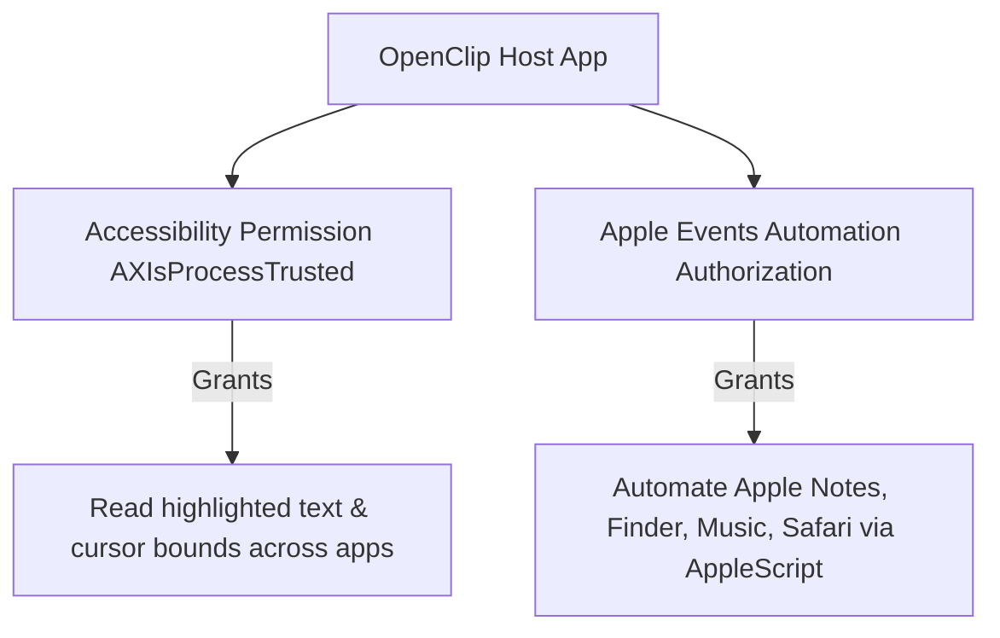

# Permissions & Security Model

OpenClip operates under macOS security frameworks, sandbox constraints, and system entitlement requirements.

---

## System Entitlements & Permissions

OpenClip requests 2 key macOS permissions:

### 1. Accessibility API (`AXIsProcessTrusted`)
- Required to monitor system-wide focused UI elements.
- OpenClip uses `AXIsProcessTrustedWithOptions` to prompt the user to enable Accessibility in **System Settings** > **Privacy & Security** > **Accessibility**.

### 2. Apple Events Automation
- Required when running AppleScript actions that send Apple Events to other applications (e.g., controlling Apple Notes or Music).
- System displays standard macOS authorization prompts per target app.

---

## Extension Security & Execution Sandboxing

### JavaScriptCore Isolation
JavaScript extensions run inside isolated, lightweight `JSContext` instances. JS extensions cannot access native C/Swift pointers or arbitrary file system paths unless explicitly exposed through native bridge calls.

### Subprocess Environment Sanitization
When executing shell scripts (`/bin/zsh`) or Python scripts (`python3`):
- Process environment variables are explicitly scoped (`OPENCLIP_TEXT`, option flags).
- Standard input and output streams are captured via `Pipe` objects without spawning shell host wrappers.
- Execution timeouts prevent runaway scripts from blocking background threads.
