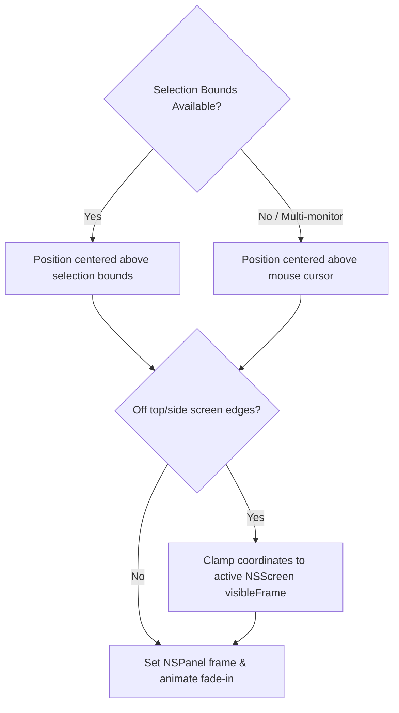

# Floating HUD Popup Window

The floating HUD popup window (`PopupWindowController.swift` & `PopupView.swift`) is the visible user interface of OpenClip.

---

## Window Architecture

The popup window is implemented as a borderless `NSPanel` floating above standard macOS windows:

- **Window Style:** `NSWindow.StyleMask.nonactivatingPanel` (prevents taking focus away from the active editing application).
- **Level:** `.floating` or `.popUpMenu` window level.
- **Background:** Transparent canvas with `NSVisualEffectView` materials for glassmorphism.
- **Behavior:** `.transient` (dismisses automatically when clicking outside or pressing `Escape`).

---

## Positioning Algorithm

The window controller calculates optimal screen coordinates based on selection bounds or mouse cursor position:

---

## SwiftUI Popup View (`PopupView.swift`)

The content of the window is rendered with SwiftUI:

- **Action Buttons:** Display icon (SF Symbol, local image, or text label) and title tooltip.
- **Hover & Micro-Animations:** Micro-animations for scale effects and color transitions when hovering over action buttons.
- **Keyboard Navigation:** Native focus ring tracking for arrow key navigation and `Space` / `Return` triggers.
