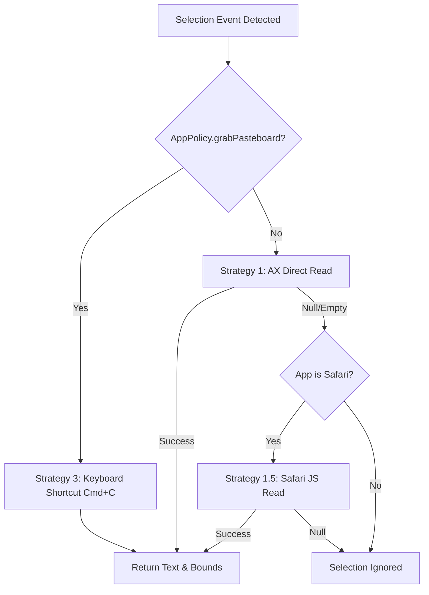

# Text Selection Subsystem Architecture

The text selection subsystem is responsible for detecting user text selection events across all macOS applications and extracting selected text non-destructively.

---

## Selection Detection Architecture

The subsystem consists of three primary components:

```
+------------------------+ +---------------------+ +----------------------+
| MacSelectionMonitor | ---> | SelectionCoordinator| ---> | ActionCoordinator |
| (Global Mouse/AX Event)| | (Context Assembly) | | (Action Resolution) |
+------------------------+ +---------------------+ +----------------------+
 | |
 v v
+------------------------+ +---------------------+
| MacTextRetriever | | AppRule / Engine |
| (AX / Safari / Cmd+C) | | (Per-App Policy) |
+------------------------+ +---------------------+
```

1. **[`MacSelectionMonitor`](../../Sources/OpenClip/Platform/MacSelectionMonitor.swift)**: Listens for mouse release events (`leftMouseUp`) or keyboard shortcuts.
2. **[`MacTextRetriever`](../../Sources/OpenClip/Platform/MacTextRetriever.swift)**: Implements [`TextRetrieving`](../../Sources/Core/Selection/TextRetrieving.swift) to extract selected text from the active frontmost application.
3. **[`SelectionCoordinator`](../../Sources/Core/Selection/SelectionCoordinator.swift)**: Receives raw selection context events, applies app rules, and notifies subscriber callbacks (such as `PopupWindowController`).

---

## Retrieval Strategy Chain

OpenClip prioritizes **zero pasteboard side-effects** during background selection detection. Text is retrieved using a structured fall-through strategy chain:



### Strategy 1: Accessibility (AX) Direct Attribute Read
- **Mechanism**: Queries `AXUIElementCreateSystemWide()` for `kAXFocusedUIElementAttribute`, then reads `kAXSelectedTextAttribute`.
- **Bounds Query**: Queries `kAXSelectedTextRangeAttribute` and `kAXBoundsForRangeParameterizedAttribute` to obtain the precise screen rectangle (`CGRect`) of the selected text.
- **Advantage**: Instant, zero side-effects, never modifies system clipboard.

### Strategy 1.5: Safari JavaScript Read
- **Target**: Safari browser tabs (`com.apple.Safari`).
- **Mechanism**: Executed if AX direct read returns empty due to web page DOM rendering delays. Executes a lightweight AppleScript snippet:
 ```applescript
 tell application "Safari"
 if (count of documents) > 0 then
 do JavaScript "window.getSelection().toString()" in front document
 end if
 end tell
 ```

### Strategy 3: Keyboard Shortcut (`Cmd+C`) Fallback
- **Trigger**: Executed **only** when an application explicitly has the `grabPasteboard: true` rule set in `AppRule` (e.g., Obsidian, Skype, Evernote).
- **Mechanism**:
 1. Backs up existing pasteboard items (`NSPasteboardItem`).
 2. Mutes system alert volume temporarily to prevent error beeps.
 3. Posts synthetic `Cmd+C` key events via `CGEvent`.
 4. Polls `NSPasteboard.general` change count every 5ms (up to 0.5s timeout).
 5. Extracts copied string.
 6. Restores original pasteboard contents after a 50ms window.

---

## Shortcut Clipboard Fallback

The strategies above apply to *passive selection monitoring*. The global toggle shortcut ([`HotkeyManager`](../../Sources/OpenClip/Platform/HotkeyManager.swift)) has an extra path: if the frontmost app yields no selection (empty or whitespace-only text), OpenClip falls back to the current contents of `NSPasteboard.general` so the popup still has input to act on.

- This is distinct from the background `grabPasteboard` strategy — it happens only on explicit shortcut invocation, never during passive monitoring.
- The context is flagged `SelectionContext.isClipboardFallback`; `PopupWindowController.show` then filters the available actions down to **Paste** (the AI button is rendered separately). Selection-oriented actions are meaningless for clipboard text, so they're hidden.

---

## Privacy & Non-Destructive Guarantees

- **No Clipboard Pollution**: Unless `grabPasteboard` is explicitly configured for an app, OpenClip **never** triggers `Cmd+C` or modifies `NSPasteboard` while monitoring selections.
- **Muted System Beeps**: When pasteboard polling is required for opted-in apps, system alert volume is muted via AppleScript during key injection so empty selection attempts remain silent.
- **Ignored Fields**: Secure text fields (such as password inputs or masked text areas) do not expose `kAXSelectedTextAttribute` through AX APIs, ensuring password security.
