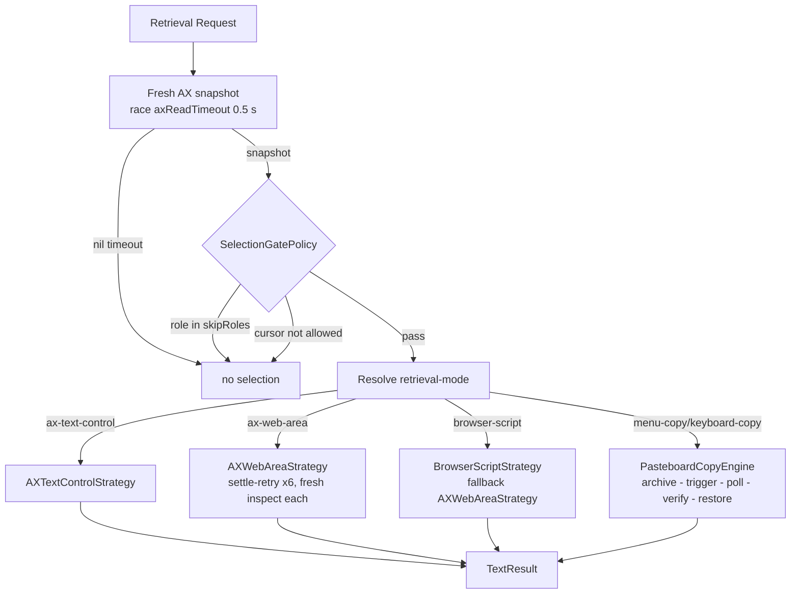

# Text Selection Subsystem Architecture

The text selection subsystem detects user text selection events across all macOS applications and extracts selected text non-destructively, then hands it to the popup.

---

## Selection Detection Architecture

The subsystem consists of three primary components:

```
+------------------------+   +-----------------------+
| MacSelectionMonitor |-->| RuleEngine |
| (Global Mouse/AX Event)|   | (Per-App Policy) |
+------------------------+   +-----------------------+
 |                |
 | builds         v
 |          +-----------------------+
 |          | SelectionContext |
 |          +-----------------------+
 v                |
+------------------------+      |
| SelectionRetrievalCoordinator |      |
| (Gate + Mode Routing) |      |
+------------------------+      |
                        v
             +-----------------------+
             | onSelection callback |
             | (PopupWindowController) |
             +-----------------------+
```

1. **[`MacSelectionMonitor`](../../Sources/OpenClip/Platform/MacSelectionMonitor.swift)**: Listens for mouse release events (`leftMouseUp`) and keyboard selection gestures (⌘A select-all, ⇧+arrow) and dispatches retrieval.
2. **[`SelectionRetrievalCoordinator`](../../Sources/OpenClip/Platform/Selection/SelectionRetrievalCoordinator.swift)**: Applies the gate, resolves the app's retrieval mode from [`AppPolicyContext`](../../Sources/Core/Rules/AppRule.swift), and routes to the matching strategy. [`MacTextRetriever`](../../Sources/OpenClip/Platform/MacTextRetriever.swift) is now a thin `TextRetrieving` facade over it.
3. **Context assembly**: `MacSelectionMonitor` resolves app rules via [`RuleEngine`](../../Sources/Core/Rules/RuleEngine.swift), builds a [`SelectionContext`](../../Sources/Core/Selection/SelectionContext.swift), and notifies subscriber callbacks (such as `PopupWindowController`).

---

## Retrieval: Resolver, Gate, and Strategies

Every retrieval request (mouse-up drag, ⌘A/⇧+arrow gesture, or the ⌥⌘C hotkey) runs through `SelectionRetrievalCoordinator.retrieve(for:policy:cursor:)`:

1. **Fresh AX snapshot** — `AXElementInspector.inspect()` resolves the focused application, then the focused UI element *from that application*, never from the system-wide element (the classic source of stale reads). It collects the role, parent/container roles, selection attributes, and selection bounds. The blocking snapshot runs on the dedicated `com.openclip.ax-inspect` queue, raced against `Constants.axReadTimeout` (0.5 s) via a once-resume gate; a hung or unresponsive target yields `nil` instead of stalling the popup.
2. **Gate** — [`SelectionGatePolicy`](../../Sources/Core/Rules/SelectionGatePolicy.swift) decides whether to attempt retrieval at all:
   - `skipRoles` — AX roles that can never hold a text selection (buttons, menus, scrollbars, …) are rejected up front.
   - `allowedCursors` — the cursor class (from [`CursorClassifier`](../../Sources/OpenClip/Platform/Selection/CursorClassifier.swift)) must suggest a text context; `.unknown` is never a reason to block.
   - `requireSelectionBeforeCopy` — for `.menuCopy`/`.keyboardCopy`, a confirmed non-empty selection must already exist before the copy engine runs (the copy must not *create* the selection).
3. **Mode routing** — the app's [`SelectionRetrievalMode`](../../Sources/Core/Rules/SelectionRetrievalMode.swift) selects the strategy:



### Retrieval modes

| Mode | kebab-case key | Strategy |
| :--- | :--- | :--- |
| AX native text control | `ax-text-control` | `AXTextControlStrategy` reads `kAXSelectedTextAttribute` (falling back to `value` + `selectedTextRange` substring) and the selection bounds. Zero pasteboard side-effects. Default. |
| AX web area | `ax-web-area` | `AXWebAreaStrategy` reads `kAXSelectedTextMarkerRange` → `AXStringForTextMarkerRange` (fallback `selectedText`). Includes a **settle-retry** loop: the snapshot is re-inspected fresh on every retry (up to `webAreaSettleMaxRetries` = 6, `webAreaSettleInterval` = 50 ms apart) so text appearing after focus is observed instead of a frozen target. |
| Browser script | `browser-script` | `BrowserScriptStrategy` reads the page selection through the browser's AppleScript automation bridge (`do JavaScript` on Safari-family front documents, `execute javascript` on Chromium/Firefox/Arc active tabs) via the watchdog-killable `osascript` subprocess. Returns nil on automation-permission errors so the coordinator falls back to `AXWebAreaStrategy`. |
| Menu copy | `menu-copy` | `PasteboardCopyEngine` archives the pasteboard, AXPresses the app's **Edit ▸ Copy** menu item (localization-agnostic title walk, fired on the dedicated AX queue), polls for a `changeCount` advance, verifies the content changed, then restores. Used for terminals. |
| Keyboard copy | `keyboard-copy` | The same engine with a synthesized ⌘C key event (`SessionEventTapPoster`) as the trigger. Used for Electron/JS apps (VS Code, Zed, …) whose AX selection reads are unreliable. |

### The copy engine and transient markers

Both copy modes run through [`PasteboardCopyEngine`](../../Sources/OpenClip/Platform/PasteboardCopyEngine.swift): archive every type of every pasteboard item → run the trigger → poll every 2 ms up to `pasteboardCopyTimeout` (0.6 s) for a `changeCount` advance → read the new string → restore the archived items after `pasteboardRestoreDelay` (0.8 s), tagged with the **nspasteboard markers** `org.nspasteboard.TransientType` and `org.nspasteboard.AutoGeneratedType` (empty data). The markers tell clipboard managers to skip the restore as a user-visible copy. The captured string therefore sits on the general pasteboard for up to ~0.8 s — see `docs/architecture/known-debt.md` for the visibility caveat.

### Per-app routing (default catalog)

`DefaultAppRules.catalog` assigns modes to app groups; `RuleEngine.resolvePolicies` matches the frontmost app's bundle id (with `.*` prefix / `*` wildcards) against default + user rules. User rules in `~/.openclip/rules.json` override per-key — see `docs/user-guide/app-rules.md` for the JSON keys.

| Group | Apps (bundle-id prefix) | Mode |
| :--- | :--- | :--- |
| `safariGroup` | Safari, SafariTechnologyPreview, Kagi | `browser-script` |
| `chromiumGroup` | Chrome (incl. Canary), Chromium, Brave, Edge (incl. Beta/Dev/Canary), Sidekick, Vivaldi, Opera (incl. Next/Developer/GX), Thorium, SigmaOS, Quark, Helium, Perplexity Comet, OpenAI Atlas, Ecosia | `browser-script` |
| `firefoxGroup` | Firefox, Developer Edition, Nightly, Waterfox, LibreWolf, Zen | `browser-script` |
| `arcGroup` | Arc, dia | `browser-script` |
| `keyboardCopyApps` | VS Code (incl. Insiders), Zed, Atom, `com.sublimetext.*`, Notion, Obsidian, Figma, WhatsApp, Evernote, `com.jetbrains.*`, 1Password, iBooks | `keyboard-copy` |
| `menuCopyApps` | Terminal, iTerm2, Ghostty | `menu-copy` |
| default | everything else | `ax-text-control` |

---

## Shortcut Clipboard Fallback

The retrieval path above applies to *passive selection monitoring*. The global toggle shortcut ([`HotkeyManager`](../../Sources/OpenClip/Platform/HotkeyManager.swift)) has an extra path: if the frontmost app yields no selection (empty or whitespace-only text), OpenClip falls back to the current contents of `NSPasteboard.general` so the popup still has input to act on.

- This happens only on explicit shortcut invocation, never during passive monitoring.
- The context is flagged `SelectionContext.isClipboardFallback`; `PopupWindowController.show` then filters the available actions down to **Paste** (the AI Tools launcher stays available — it doesn't touch the selection). Selection-oriented actions are meaningless for clipboard text, so they're hidden.

---

## Privacy & Non-Destructive Guarantees

- **No Clipboard Pollution (AX modes)**: `ax-text-control`, `ax-web-area`, and `browser-script` never write to `NSPasteboard` — they read the live accessibility tree or the browser's AppleScript bridge.
- **Copy modes are archive-and-restore**: `menu-copy`/`keyboard-copy` temporarily place the selected text on the general pasteboard, then restore the archived items tagged with the nspasteboard transient markers so clipboard managers don't treat the restore as a user copy.
- **Ignored Fields**: Secure text fields (such as password inputs or masked text areas) do not expose `kAXSelectedTextAttribute` through AX APIs, ensuring password security.