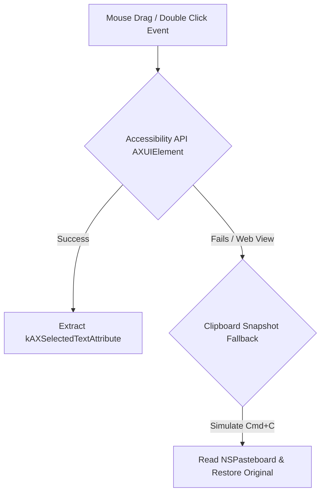

# Text Selection Subsystem

The Text Selection Subsystem is responsible for detecting when a user highlights text in any macOS application, extracting the text string, identifying the active source application, and determining cursor or selection bounds for popup HUD placement.

---

## Selection Context Data Model

When text is selected, OpenClip constructs a `SelectionContext` struct containing:

```swift
public struct SelectionContext: Sendable {
    public let text: String                   // Extracted text selection
    public let sourceApp: NSRunningApplication?// Active source application
    public let cursorPosition: CGPoint        // Mouse cursor screen coordinates
    public let selectionBounds: CGRect?      // Selection bounding box in screen coordinates
    public let timestamp: Date                // Timestamp of selection event
    public let appPolicy: AppPolicy           // Active policy for source application
}
```

---

## Detection Strategies

OpenClip uses a multi-tiered strategy to capture selected text across different types of macOS applications:



### 1. Accessibility API (`AXUIElement`)
- Queries the currently focused UI element (`kAXFocusedUIElementAttribute`).
- Reads the selected text attribute (`kAXSelectedTextAttribute`) and parameterised bounds (`kAXBoundsForRangeParameterizedAttribute`).
- Provides zero-latency, silent text extraction without mutating the macOS Clipboard.

### 2. Clipboard Snapshot Fallback (Non-AX Applications)
- Used for custom web views or non-standard UI frameworks that do not expose standard AX attributes.
- OpenClip temporarily snapshots current `NSPasteboard` contents.
- Simulates a synthetic `Cmd + C` keypress event.
- Reads the newly copied selection text, and immediately restores original clipboard contents.
