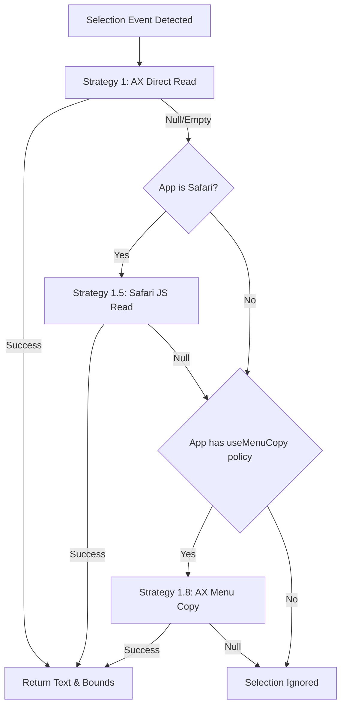

# Text Selection Subsystem Architecture

The text selection subsystem is responsible for detecting user text selection events across all macOS applications and extracting selected text non-destructively.

---

## Selection Detection Architecture

The subsystem consists of three primary components:

```
+------------------------+   +---------------------+
| MacSelectionMonitor |-->| RuleEngine |
| (Global Mouse/AX Event)|   | (Per-App Policy) |
+------------------------+   +---------------------+
 |                |
 | builds         v
 |          +---------------------+
 |          | SelectionContext |
 |          +---------------------+
 v                |
+------------------------+      |
| MacTextRetriever |      |
| (AX / Safari / AX Menu Copy) |      |
+------------------------+      |
                        v
             +-----------------------+
             | onSelection callback |
             | (PopupWindowController) |
             +-----------------------+
```

1. **[`MacSelectionMonitor`](../../Sources/OpenClip/Platform/MacSelectionMonitor.swift)**: Listens for mouse release events (`leftMouseUp`) or keyboard shortcuts.
2. **[`MacTextRetriever`](../../Sources/OpenClip/Platform/MacTextRetriever.swift)**: Implements [`TextRetrieving`](../../Sources/Core/Selection/TextRetrieving.swift) to extract selected text from the active frontmost application.
3. **Context assembly**: `MacSelectionMonitor` resolves app rules via [`RuleEngine`](../../Sources/Core/Rules/RuleEngine.swift), builds a [`SelectionContext`](../../Sources/Core/Selection/SelectionContext.swift), and notifies subscriber callbacks (such as `PopupWindowController`).

---

## Retrieval Strategy Chain

OpenClip prioritizes **zero pasteboard side-effects** during background selection detection. Text is retrieved using a structured fall-through strategy chain:



### Strategy 1: Accessibility (AX) Direct Attribute Read
- **Mechanism**: Queries `AXUIElementCreateSystemWide()` for `kAXFocusedUIElementAttribute`, then reads `kAXSelectedTextAttribute`.
- **Bounds Query**: Queries `kAXSelectedTextRangeAttribute` and `kAXBoundsForRangeParameterizedAttribute` to obtain the precise screen rectangle (`CGRect`) of the selected text.
- **Advantage**: Instant, zero side-effects, never modifies system clipboard.

### Strategy 1.5: Safari JavaScript Read
- **Target**: Safari browser tabs (`com.apple.Safari`).
- **Mechanism**: Executed if AX direct read returns empty due to web page DOM rendering delays. Executes a lightweight AppleScript snippet:
 ```applescript
 tell application "Safari"
 if (count of documents) > 0 then
 do JavaScript "window.getSelection().toString()" in front document
 end if
 end tell
 ```

### Strategy 1.8: AX Menu Copy
- **Target**: Apps with the `useMenuCopy` policy (VS Code, Zed, Obsidian, etc.) whose AX selection reads are unreliable.
- **Mechanism**: Walks the app's AX menu bar to Edit ▸ Copy and performs an `AXPress`, then polls the pasteboard for a change (0.15 s), restoring the original contents afterward.

---

## Shortcut Clipboard Fallback

The strategies above apply to *passive selection monitoring*. The global toggle shortcut ([`HotkeyManager`](../../Sources/OpenClip/Platform/HotkeyManager.swift)) has an extra path: if the frontmost app yields no selection (empty or whitespace-only text), OpenClip falls back to the current contents of `NSPasteboard.general` so the popup still has input to act on.

- This happens only on explicit shortcut invocation, never during passive monitoring.
- The context is flagged `SelectionContext.isClipboardFallback`; `PopupWindowController.show` then filters the available actions down to **Paste** (the AI Tools launcher stays available — it doesn't touch the selection). Selection-oriented actions are meaningless for clipboard text, so they're hidden.

---

## Privacy & Non-Destructive Guarantees

- **No Clipboard Pollution**: OpenClip **never** sends `Cmd+C` and never modifies `NSPasteboard` during passive selection monitoring. The only pasteboard-touching strategy is the AX Menu Copy fallback, which saves and restores the original contents around the read.
- **Ignored Fields**: Secure text fields (such as password inputs or masked text areas) do not expose `kAXSelectedTextAttribute` through AX APIs, ensuring password security.
