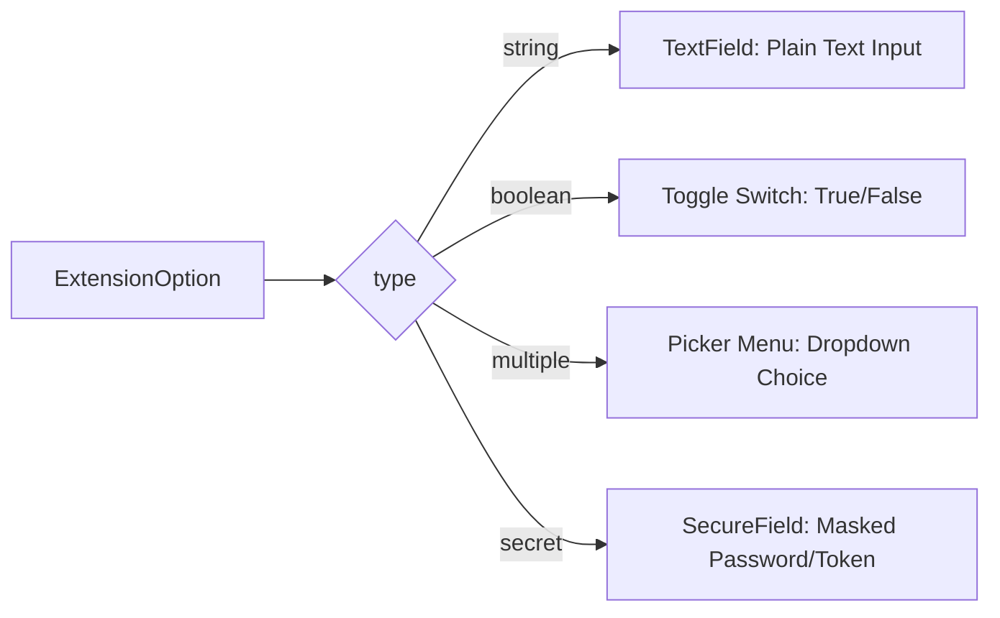

# Declarative Extension Options UI

OpenClip features a declarative configuration framework (`ExtensionOption`) that allows extensions to declare user-configurable options in their manifest. OpenClip dynamically builds native SwiftUI configuration sheets for these options in Preferences!

---

## Supported Option Control Types

OpenClip supports 4 declarative option types (`ExtensionOptionType`):



### 1. `string` (Plain Text Input)
Renders a standard single-line `TextField`. Use for text options like domain names, search queries, or user IDs.

```json
{
  "identifier": "domain",
  "label": "Custom Domain",
  "type": "string",
  "default value": "example.com"
}
```

### 2. `boolean` (Switch Toggle)
Renders a SwiftUI `Toggle` switch. Values are stored as `"true"` or `"false"`.

```json
{
  "identifier": "uppercase_output",
  "label": "Uppercase Result",
  "type": "boolean",
  "default value": "true"
}
```

### 3. `multiple` (Dropdown Picker)
Renders a SwiftUI `Picker` popover menu. You must provide an `options` array containing string choices.

```json
{
  "identifier": "format",
  "label": "Output Format",
  "type": "multiple",
  "default value": "JSON",
  "options": ["JSON", "YAML", "XML", "CSV"]
}
```

### 4. `secret` (Secure Field)
Renders a masked `SecureField`. Ideal for API keys, bearer tokens, or user passwords.

```json
{
  "identifier": "api_key",
  "label": "API Key",
  "type": "secret",
  "default value": ""
}
```

---

## Manifest Declaration Example

Here is a complete manifest declaring multiple user options:

```json
{
  "Identifier": "com.example.formattingtool",
  "Name": "Code Formatter",
  "Actions": [
    {
      "Title": "Format",
      "Icon": "symbol:wand.and.stars",
      "Script": "main.js"
    }
  ],
  "Options": [
    {
      "identifier": "tab_size",
      "label": "Tab Indent Size",
      "type": "multiple",
      "default value": "2",
      "options": ["2", "4", "8"]
    },
    {
      "identifier": "semicolons",
      "label": "Insert Semicolons",
      "type": "boolean",
      "default value": "true"
    },
    {
      "identifier": "auth_token",
      "label": "Cloud Service Token",
      "type": "secret",
      "default value": ""
    }
  ]
}
```

---

## Accessing Options in Runtimes

### In JavaScript Runtimes
In JS extensions, option values are automatically injected into `openclip.options`:

```javascript
const tabSize = parseInt(openclip.options.tab_size || '2');
const useSemicolons = openclip.options.semicolons === 'true';
const token = openclip.options.auth_token;
```

### In Shell & Python Runtimes
In Zsh or Python scripts, options are injected as environment variables:

```bash
# In Zsh
echo "Tab size: $OPTION_TAB_SIZE"
```

```python
# In Python
import os
token = os.environ.get("OPTION_AUTH_TOKEN", "")
```
