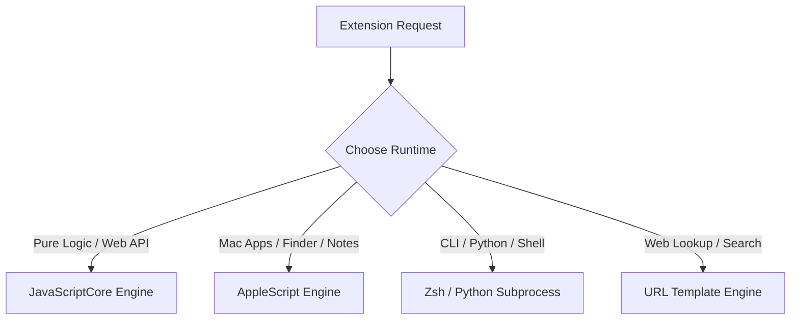

# Extension Developer Guide: Overview

OpenClip is built from the ground up as an extensible platform. Developers can build custom extensions to transform text, interface with macOS apps, call web APIs, run command-line tools, or perform complex automated workflows.

---

## Extension Runtimes Comparison

OpenClip supports 4 distinct execution runtimes to fit any extension development requirement:

| Runtime | Execution Environment | Best For | Key Capabilities |
|---------|-----------------------|----------|------------------|
| **JavaScript (JSC)** | Native `JSContext` | Text manipulation, string transformation, REST APIs | Fast, lightweight, `openclip` bridge, `XHR` support |
| **AppleScript** | `NSAppleScript` | Automating macOS apps (Notes, Music, Safari, Finder) | Native macOS app IPC, System Events |
| **Zsh & Python** | `/bin/zsh` / `python3` subprocess | Local CLI tools, data processing, heavy scripting | Access to full Unix environment, pip modules |
| **URL Templates** | Browser URL scheme | Web search, dictionary lookup, deep links | Zero code needed, dynamic `{text}` replacement, regex filters |

---

## Extension Formats

Extensions can be created in 2 ways:

1. **`.openclipext` Packages:** Complete extension directory bundles containing a JSON manifest, script files, custom icons, and option declarations.
2. **Single-File Snippets:** Quick single-file scripts with metadata headers (`#openclip` or `//openclip`). Ideal for quick sharing and copy-pasting.

---

## The Action Lifecycle

When an action is triggered by the user:

1. OpenClip captures the active text selection as a `SelectionContext` object.
2. OpenClip executes your script or opens your URL template.
3. Your extension returns an `ActionResult` (or invokes bridge methods like `openclip.pasteText()` or `openclip.openUrl()`).
4. OpenClip performs the requested host mutation:
   - `.copy(text)`: Copies output to macOS Clipboard.
   - `.paste(text)`: Replaces active text selection in target app.
   - `.openURL(url)`: Opens specified URL in default browser.
   - `.success`: Action completed with no clipboard/selection mutation.

---

## Next Steps

- Learn about **[Extension Package Format](package-format.md)** to create full `.openclipext` bundles.
- Read **[Single-File Snippets](snippets.md)** for fast script creation.
- Explore **[Declarative Options UI](options-ui.md)** to add user configuration settings.
