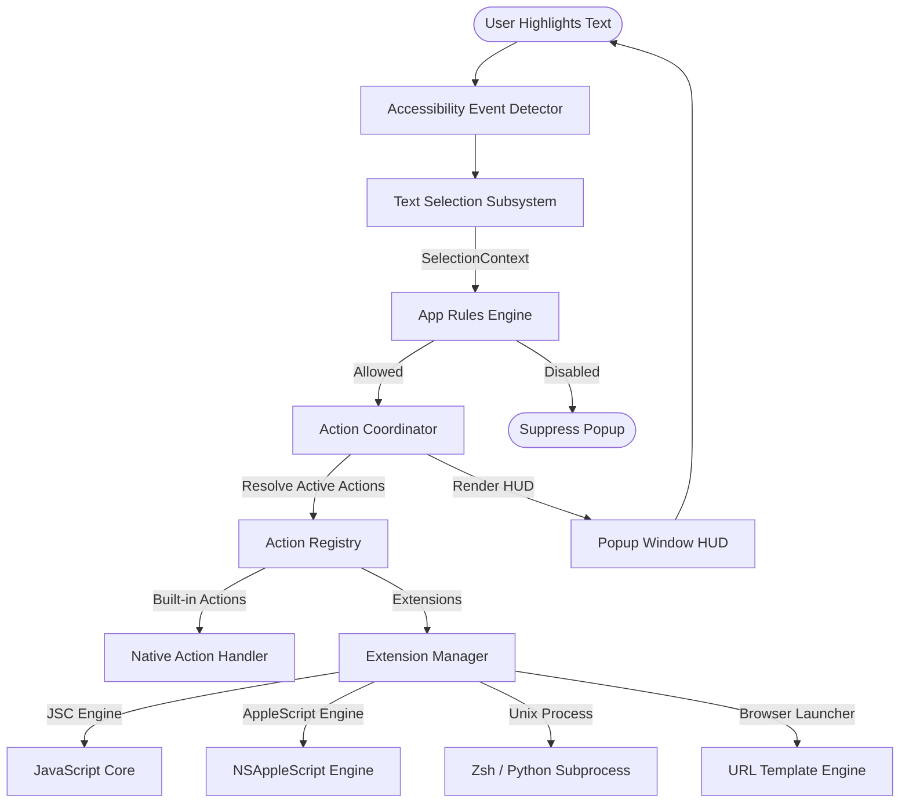

# OpenClip Documentation

Welcome to the official documentation for **OpenClip**, the open-source text selection action tool and extension runtime for macOS.

OpenClip appears dynamically whenever you highlight text in any macOS application, offering contextual actions such as copying, searching, transforming text, running shell commands, executing JavaScript snippets, or triggering AppleScript routines.

---

## Key Features

- ⚡ **Contextual Action Popup:** Appears instantly near your text selection or mouse cursor across native macOS applications, web browsers, and electron apps.
- 🎨 **Modern Glassmorphic UI:** Designed specifically for macOS with support for native dark mode, custom themes, sizing, and smooth animations.
- 🔌 **Multi-Runtime Extension System:** Support for 4 extension runtimes:
  - **JavaScriptCore (JSC):** High-performance inline JavaScript execution with native bridge APIs.
  - **AppleScript:** Seamless automation of macOS system services and third-party Mac applications.
  - **Zsh / Python Executables:** Run local shell scripts, command-line tools, and custom binaries.
  - **URL Templates:** Instant web lookups with dynamic query substitution and regular expression matching.
- ⚙️ **Declarative Option UIs:** Extensions can define user-configurable options (text fields, switch toggles, choice dropdowns, secure password fields) rendered automatically in the OpenClip Preferences UI.
- 🛡️ **Per-Application Policy Engine:** Enable, disable, or customize popup behavior per application (e.g. disable in IDEs or Terminal, enable everywhere else).
- 🔓 **Fully Open Source:** Clean Swift & SwiftUI implementation built on native macOS APIs (`AXUIElement`, `JSContext`, `NSAppleScript`).

---

## High-Level Architecture

The diagram below illustrates how OpenClip captures text selections, evaluates application policies, coordinates built-in and extension actions, and renders the action HUD popup:

---

## Quick Navigation

-   :material-rocket-launch: **[User Guide](user-guide/installation.md)**

    ---

    Learn how to install OpenClip, request system permissions, configure preferences, and manage custom application rules.

-   :material-code-brackets: **[Developer Guide](developer-guide/overview.md)**

    ---

    Discover how to create custom extensions using `.openclipext` packages, manifest declarations, and single-file text snippets.

-   :material-console: **[Extension Runtimes](runtimes/javascript.md)**

    ---

    Explore detailed guides and copy-pasteable code examples for JavaScript, AppleScript, Zsh/Python, and URL Templates.

-   :material-sitemap: **[System Architecture](architecture/overview.md)**

    ---

    Deep dive into OpenClip's internal Swift subsystems: Accessibility text extraction, Action Coordinator, and Floating HUD lifecycle.

---

## Getting Started

1. Check out the **[Installation & Setup Guide](user-guide/installation.md)** to install OpenClip and grant the required macOS Accessibility permissions.
2. Read the **[Extension Developer Guide](developer-guide/overview.md)** to start building your own actions.
3. Explore the **[Built-in Actions Catalog](reference/builtin-actions.md)** to see everything OpenClip provides out of the box.
