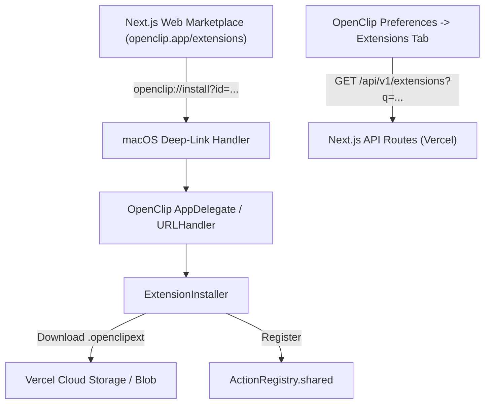

# OpenClip Extensions Tab & Dynamic Marketplace Integration Design Spec

**Date:** 2026-08-01  
**Status:** Approved  
**Target:** OpenClip macOS Application & `openclip://` Deep-Link Protocol

---

## 1. Executive Summary

OpenClip will feature a dynamic **"Extensions"** tab inside Preferences. Instead of hardcoding extension listings, OpenClip dynamically queries an external Next.js + Vercel API (`/api/v1/extensions`) for search results, category filtering, and lazy-loaded extension cards. 

Additionally, OpenClip registers a custom macOS URL scheme (`openclip://install`) so users browsing the web marketplace can install extensions in one click.

---

## 2. System Architecture

### Key Responsibilities:
- **OpenClip App Scope (This Repository):**
  1. `Extensions` tab in `PreferencesView` with debounced search, category filter, lazy-loaded pagination, and "Open Web Store" button.
  2. `openclip://install` URL scheme handler in `AppDelegate.swift` / `OpenClipApp.swift`.
  3. `ExtensionInstaller` service for downloading, unzipping, validating, and activating `.openclipext` packages.
  4. Configurable API endpoint (`https://openclip.app/api/v1/extensions`) with a local fallback/mock mode for development.
- **Web & API Scope (Built separately):**
  1. Next.js app deployed on Vercel utilizing Vercel Blob/Cloud Storage for package files and Next.js API routes for `/api/v1/extensions`.

---

## 3. Detailed Component Specifications

### 3.1 In-App "Extensions" Preferences Tab (`Sources/OpenClip/UI/Preferences/ExtensionsMarketplaceView.swift`)

- **Search & Filters:**
  - `TextField` search bar with 300ms debounce.
  - Category Picker: `All`, `Productivity`, `Developer`, `Utilities`, `Text Tools`.
  - **"Open Web Store"** button opening default browser to `https://openclip.app/extensions`.
- **Lazy Loading Grid / List:**
  - Uses `ScrollView` with `LazyVStack` or `LazyVGrid`.
  - Triggers next page load (`page += 1`) when scrolling within 2 items of the bottom.
  - API query: `GET /api/v1/extensions?q={search}&category={category}&page={page}&limit=12`.
- **Extension Card View:**
  - Display: SF Symbol or custom icon image, Title, Author name, Download count (`⬇ 1.2k`), and brief description.
  - State-aware Action Button:
    - `Install` (Active button if not installed)
    - `Installing...` (Progress view during zip download/extraction)
    - `Installed ✓` (Disabled / secondary state if action ID exists in `ActionRegistry.shared`)

### 3.2 Deep-Link Installation Handler (`openclip://install`)

- **URL Protocol Format:**
  `openclip://install?id=<ext_id>&name=<ext_name>&url=<encoded_download_url>`
- **Handler Flow in `AppDelegate.swift` / `NSApp`:**
  1. MacOS handles `openclip://` URL opening.
  2. Parses query parameters `id`, `name`, and `url`.
  3. Invokes `ExtensionInstaller.shared.installFromRemoteURL(url, actionID: id)`.
  4. Downloads `.openclipext` zip or script file asynchronously.
  5. Extracts to `~/.openclip/extensions/`.
  6. Invokes `ExtensionManager.shared.loadExtensions()`.
  7. Triggers a toast/HUD notification in OpenClip: `"Installed <Name>"`.

### 3.3 Security & Hardening

- **Zip-Slip Hardening:** During zip extraction in `ExtensionInstaller`, all destination paths are verified to begin strictly within `~/.openclip/extensions/`.
- **URL Scheme Validation:** Only `https://` URLs are accepted for extension package downloads.
- **Sandbox Isolation:** Scripts execute in subprocesses with scoped environment variables (`OPENCLIP_TEXT`).

---

## 4. Test Strategy & Verification

1. **Unit Tests (`MarketplaceAPITests.swift`):**
   - Verify debounced search queries and JSON pagination decoding.
   - Test `openclip://` URL parsing and query parameter extraction.
2. **Integration Tests (`RemoteExtensionInstallerTests.swift`):**
   - Test remote ZIP package downloading, path validation, and registry insertion.
3. **UI Verification:**
   - Verify `Extensions` tab layout, category filtering, and "Open Web Store" button action.

---
