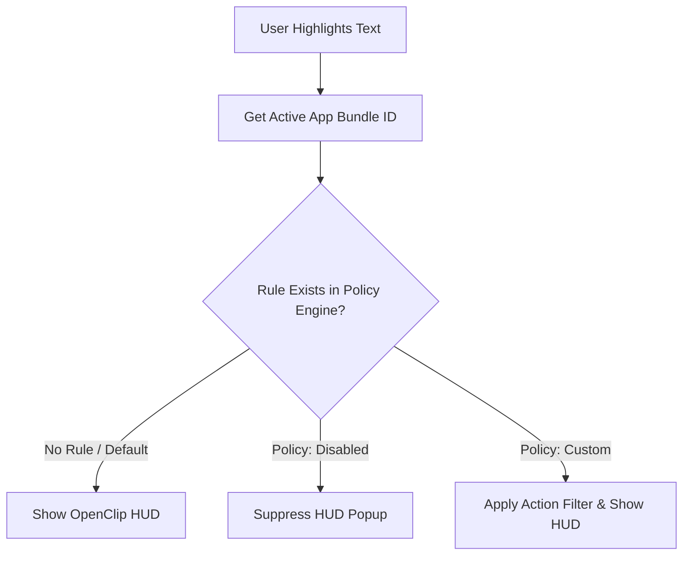

# Application Rules & Policy Engine

OpenClip includes a per-application policy engine (`AppRulesTab.swift`, `AppPolicy`) that lets you control popup behavior depending on which macOS application is currently active.

---

## Why Use App Rules?

Certain applications have built-in text selection menus or specialized workflows where an overlay popup might interfere with your productivity:

- **IDEs & Code Editors:** Xcode, VS Code, Nova, IntelliJ IDEA.
- **Terminal Emulators:** iTerm2, macOS Terminal, Alacritty, Ghostty.
- **Password Managers:** 1Password, Bitwarden, KeePassXC (to prevent accidental clipboard exposure).
- **Design Tools:** Figma, Sketch, Adobe Illustrator.

With App Rules, you can tell OpenClip to remain silent in specific applications or customize which actions appear.

---

## Policy Modes

Each application rule can be set to one of 3 policy modes:

| Mode | Behavior |
|------|----------|
| **Default (Enabled)** | OpenClip behaves normally, triggering the action HUD whenever text is highlighted. |
| **Disabled** | OpenClip is completely suppressed when working inside this application. |
| **Custom** | OpenClip triggers, but limits available actions to a specific filtered subset. |

---

## Configuring Application Rules

1. Open **Preferences** (`Cmd + ,`).
2. Select the **App Rules** tab in the sidebar.
3. Click **Add Application Rule…** (`+`).
4. Select the target application using the native macOS Application Picker sheet.
5. Set the desired policy mode (**Disabled** or **Custom**).

---

## Bundle Identifier Examples

Common application bundle IDs used in policy rules:

- **Xcode:** `com.apple.dt.Xcode`
- **VS Code:** `com.microsoft.VSCode`
- **iTerm2:** `com.googlecode.iterm2`
- **macOS Terminal:** `com.apple.Terminal`
- **1Password:** `com.1password.1password`
- **Safari:** `com.apple.Safari`
