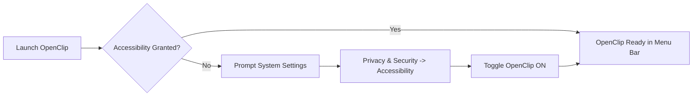

# Installation & Setup

This guide details system requirements, installation methods, and system permission configuration for OpenClip.

---

## System Requirements

- **Operating System:** macOS 13.0 (Ventura) or later (macOS 14 Sonoma and macOS 15 Sequoia fully supported).
- **Architecture:** Universal Binary (Apple Silicon M1/M2/M3/M4 & Intel x86_64).
- **Permissions:** Accessibility (`AXIsProcessTrusted`).

---

## Installation Methods

### Method 1: Building from Source with Xcode

1. Clone the OpenClip repository:
   ```bash
   git clone https://github.com/openclip-app/openclip.git
   cd openclip
   ```
2. Generate the Xcode project using XcodeGen (if needed) or open `OpenClip.xcodeproj`:
   ```bash
   open OpenClip.xcodeproj
   ```
3. Select the `OpenClip` scheme and target **My Mac**.
4. Press `Cmd + R` to build and run the application.

### Method 2: Command-Line Build

You can also build OpenClip from the command line using `xcodebuild`:

```bash
xcodebuild -project OpenClip.xcodeproj -scheme OpenClip -configuration Release build
```

The compiled binary will be placed inside `build/Release/OpenClip.app`. Move `OpenClip.app` to your `/Applications` directory.

---

## Granting System Permissions

OpenClip relies on macOS Accessibility APIs (`AXUIElement`) to detect selected text in active applications and position the action popup near your cursor.

> [!IMPORTANT]
> Without Accessibility permissions, OpenClip cannot detect highlighted text or display the HUD popup automatically.

### Enabling Accessibility Access

1. Open OpenClip. If Accessibility access is missing, OpenClip will prompt you automatically.
2. Open **System Settings** on your Mac.
3. Navigate to **Privacy & Security** > **Accessibility**.
4. Locate **OpenClip** in the list and toggle the switch **ON**.
5. If prompted, enter your macOS administrator password.



---

## First-Run Verification

Once permissions are granted:

1. Look for the OpenClip status icon in your macOS Menu Bar.
2. Open any application (e.g. Safari, TextEdit, Pages).
3. Highlight a sentence or phrase with your mouse cursor.
4. The OpenClip action HUD popup should appear immediately above your selection!

---

## Launch at Login

To make sure OpenClip is always running:

1. Click the OpenClip menu bar icon or press your global hotkey to open **Preferences**.
2. Under the **General** tab, check **Start at Login**.
