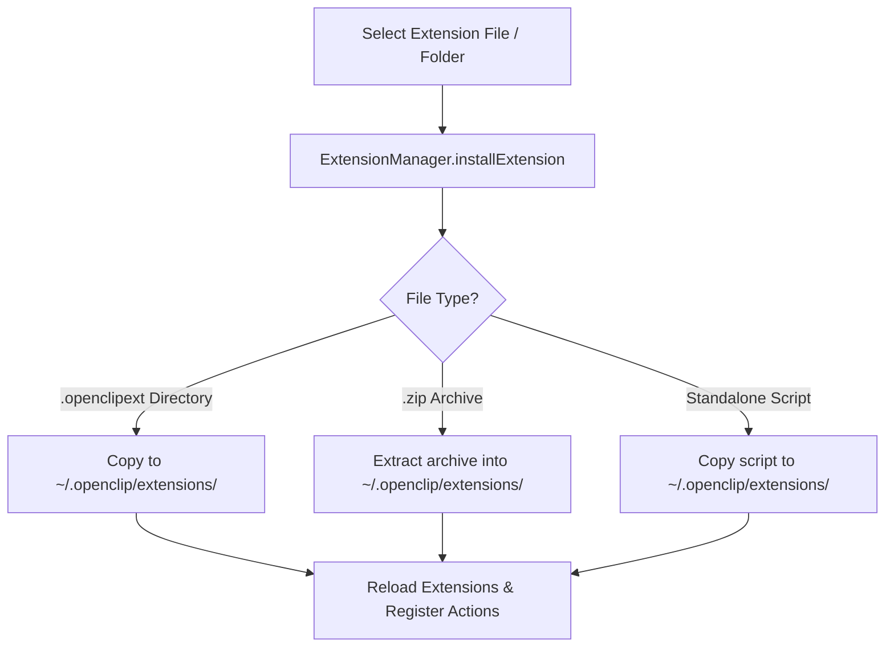

# Managing Extensions

OpenClip provides a flexible extension architecture allowing users to install, configure, update, and remove third-party actions seamlessly.

---

## Extension Package Formats

OpenClip supports 3 extension distribution formats:

1. **`.openclipext` Folders (or `.popclipext`):** A standard directory package containing a manifest (`openclip.json` or `Config.json`) and source files (`main.js`, `script.sh`, `main.applescript`).
2. **`.zip` Archives:** Compressed extension packages. OpenClip automatically unpacks and installs these into `~/.openclip/extensions`.
3. **Standalone Script Snippets:** Single-file scripts (`.sh`, `.py`, `.js`, `.applescript`) containing `#openclip` or `//openclip` header metadata.

---

## Extension Installation

### Method 1: Using Preferences UI

1. Open **Preferences** (`Cmd + ,` or menu bar icon).
2. Navigate to the **Actions** tab.
3. Click **Install Extension…** at the bottom of the window.
4. Select any `.openclipext` folder, `.zip` archive, or script snippet.
5. OpenClip will install the extension to `~/.openclip/extensions` and refresh the Action Registry automatically.



### Method 2: Manual Directory Installation

You can also copy extensions directly into the OpenClip extensions directory:

```bash
mkdir -p ~/.openclip/extensions
cp -R MyExtension.openclipext ~/.openclip/extensions/
```

OpenClip automatically scans `~/.openclip/extensions` on launch.

---

## Configuring Extension Options

When an extension defines declarative user options (via `ExtensionOption`), OpenClip renders a dynamic settings view for that extension inside Preferences:

1. In **Preferences** > **Actions**, find the installed extension.
2. Click the **Gear Icon** (`gearshape`) next to the extension title.
3. Adjust options dynamically:
   - **Text Fields:** Input API keys, tokens, or custom URLs.
   - **Switch Toggles:** Enable or disable feature flags (`true` / `false`).
   - **Dropdown Pickers:** Select choices from pre-configured lists.
   - **Secure Fields:** Password-masked input fields.

Options are automatically persisted in `UserDefaults` under key pattern:
`action.<action_id>.option.<option_identifier>`

---

## Uninstalling Extensions

To remove an extension:

1. Open **Preferences** > **Actions**.
2. Click the **Trash Icon** (`trash`) on the extension row.
3. Confirm uninstallation.

OpenClip will:
- Unregister the action from `ActionRegistry`.
- Remove the extension directory or file from `~/.openclip/extensions`.
- Instantly remove the action from the HUD popup.
