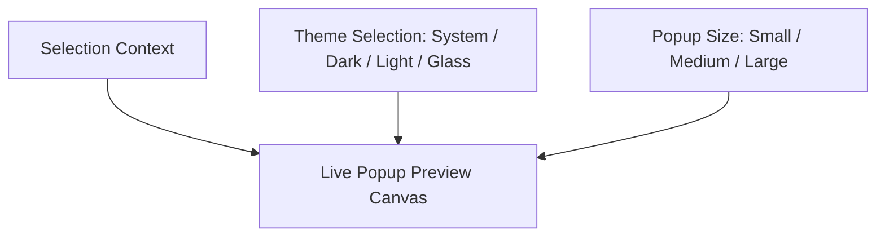

# Preferences & Customization

OpenClip features a native macOS Preferences window built with SwiftUI. It provides granular control over global settings, popup appearance, action layouts, AI integrations, and per-application rules.

---

## Preference Tabs Overview

The Preferences window is divided into 6 dedicated tabs accessible via the sidebar:

| Tab | Purpose | Key Settings |
|-----|---------|--------------|
| **General** | Global app behavior & status | Master toggle, Global hotkey recorder, Start at Login, Accessibility status |
| **Appearance** | Visual styling & live preview | Theme selection, Popup size scaling, Live preview canvas |
| **Actions** | Layout & action management | Drag-and-drop reordering, Enable/disable switches, Gear options sheets, Install extensions |
| **AI** | Local & cloud LLM configuration | API keys, Custom endpoints, Model selection, Prompt templates |
| **App Rules** | Per-application policy engine | Exclusion lists, Rule modes (Default, Disabled, Custom) |
| **About** | App information & links | Version number, license information, GitHub link |

---

## General Tab

The **General** tab controls core system integration:

- **Enable OpenClip:** Master toggle to pause or activate text selection monitoring globally.
- **Trigger Popup Shortcut:** Record a custom global hotkey (e.g. `Option + Space`) using `KeyboardShortcuts` to manually invoke the popup HUD over selected text.
- **Start at Login:** Automatically launches OpenClip when you log into your Mac.
- **System Permissions Status:** Real-time indicator of macOS Accessibility permissions with a direct link to macOS System Settings.

---

## Appearance Tab

Customize the look and feel of the floating action popup:

- **Theme Style:** Choose between:
  - `System`: Matches macOS system appearance automatically.
  - `Dark`: Sleek dark theme with high contrast.
  - `Light`: Clean light theme.
  - `Glass`: Modern glassmorphic translucent visual effect.
- **Popup Size:** Adjust button dimensions and font sizes (`small`, `medium`, `large`).
- **Live Preview:** Real-time preview panel that displays how your action HUD looks as you change theme or size settings.

---

## Actions & Custom Layouts Tab

Manage available built-in actions and installed extensions:

### Drag-and-Drop Reordering
Click and drag any action row to change its display order in the HUD popup. The order in this list matches the exact button order in the popup window.

### Enabling & Disabling Actions
Use the switch toggle on each action row to show or hide specific actions. Disabled actions are stored in `UserDefaults` under `disabledActionIDs`.

### Action Options Sheet
Clicking the **Gear Icon** next to any action opens the **Action Configuration Sheet** (`EditActionSheet` / `DynamicActionConfigView`). Here you can:
- Customize display title and icon (SF Symbol or custom text label).
- Configure extension-specific options (e.g., API keys, default search engines, formatting flags).

### Installing & Uninstalling Extensions
- **Install Extension…:** Opens a file picker to select `.openclipext` folders, `.zip` archives, or standalone script files (`.sh`, `.py`, `.js`).
- **Trash Icon:** Removes custom actions or uninstalls third-party extensions from `~/.openclip/extensions`.

---

## AI Tab

Configure LLM integrations for intelligent text processing actions (summarization, rewrite, grammar check, code explanation):

- **API Provider:** Select OpenAI, Anthropic, Ollama (local), or custom OpenAI-compatible endpoints.
- **API Key & Endpoint:** Securely enter your API keys.
- **Model Selection:** Choose models like `gpt-4o`, `claude-3-5-sonnet`, or local models (`llama3`).

---

## App Rules Tab

Specify applications where OpenClip should be automatically disabled or customized. See the **[Application Rules Guide](app-rules.md)** for detailed instructions.
