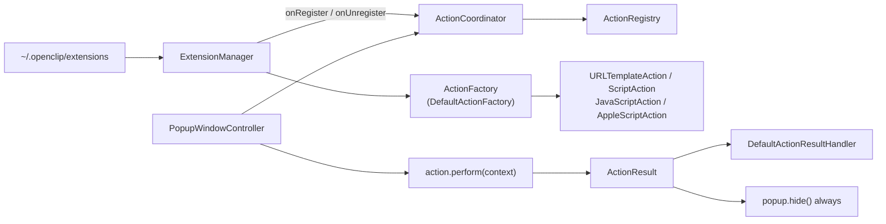
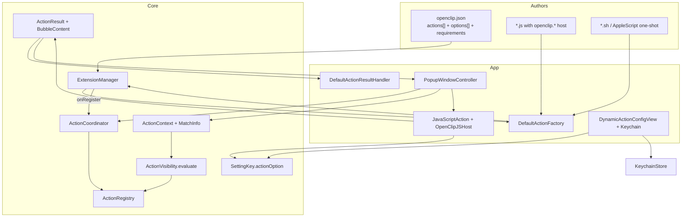

# OpenClip Extension System Expansion

| Field | Value |
| :--- | :--- |
| **Title** | OpenClip Extension System Expansion |
| **Author** | (implementation team) |
| **Date** | 2026-08-03 (revised 2026-08-04) |
| **Status** | Implemented (Phases 1–8; branch `ext/extension-expansion`, 10 commits) |
| **Repo** | `/Users/ganesh/dev/openclip` |
| **Audience** | Senior engineers implementing against Core + App targets |

---

## Overview

OpenClip’s extension surface today can load packages from `~/.openclip/extensions`, parse JSON manifests / snippet headers, and materialize four runtimes (URL template, shell script file, AppleScript, JavaScript). That path is real and tested (`ExtensionManager`, `DefaultActionFactory`, `GoldenExtensionPlatformTests`), but it is intentionally thin: one visibility rule (regex on URL actions only), package-level options only, option values read through raw `UserDefaults` / `@AppStorage`, a minimal JS bridge (`openUrl` / `pasteText` / `showNotification`), and an `ActionResult` enum that can only drive pasteboard / URL / Services side-effects — never structured UI, stay-visible behavior, settings prompts, key presses, or Shortcuts.

This design expands **OpenClip’s own** extension system so third-party authors can ship rich extensions without forking the app. The model is hybrid:

1. **Declarative fast path** — JSON manifest fields declare action kinds, visibility, after-behavior, and options; the factory materializes pure Core or thin App actions.
2. **Live JavaScript surface** — the only in-process runtime that can call back into OpenClip (structured results, options, settings-required, stay-visible). Shell and AppleScript remain one-shot scripts with an expanded stdout/result protocol; they do **not** get a live host API.

Presentation stays **capability, not canvas**: extensions compose `BubbleContent` / status / menu building blocks and choose presets; the app owns all pixels, fonts, materials, and chrome via design tokens (`BubbleCardView`, popup bar, preferences sheets).

---

## Background & Motivation

### Current architecture (verified in code)



| Seam | File | Role today |
| :--- | :--- | :--- |
| Action protocol | `Sources/Core/Actions/Action.swift` | `id/title/icon/chrome/isEnabled/perform/actionOptions` |
| Registry | `Sources/Core/Actions/ActionRegistry.swift` | Catalog + disable filter + order |
| Coordinator | `Sources/Core/Actions/ActionCoordinator.swift` | Wires manager callbacks → registry; resolves app rules |
| Result | `Sources/Core/Actions/ActionResult.swift` | `success/failure/simulatePaste/openURL/copy/cut/paste/showServices/none` |
| Bubble model | `Sources/Core/Actions/BubbleContent.swift` | Pure value types: rows, footer, emphasis (info/result/menu) |
| Options model | `Sources/Core/Actions/ExtensionOption.swift` | `string/boolean/multiple/secret` |
| Manifest | `Sources/Core/Extensions/Manifest/*`, `ExtensionManager.ExtensionMetadata` | Multi-action array already decoded; options package-level. The loader decodes via `ExtensionMetadata` / `ExtensionOptionMetadata` (both in `ExtensionManager.swift`); the `ExtensionManifest` struct in `Manifest/` has no `options` field |
| Factory | `Sources/OpenClip/Platform/Extensions/DefaultActionFactory.swift` | Birth door for App runtimes |
| JS runtime | `Sources/OpenClip/Actions/JavaScriptAction.swift` | JSC + raw UserDefaults options |
| Effects | `Sources/OpenClip/Platform/Effects/ActionResultHandler.swift` | Pasteboard / URL / Services / key paste |
| Popup | `Sources/OpenClip/UI/Popup/PopupWindowController.swift` | Always `hide()` after `onResult` |
| Settings UI | `DynamicActionConfigView.swift` | `@AppStorage("action.<id>.option.<opt>")` |
| Secrets | `KeychainStore.swift` + `AIServiceManager` | Pattern exists; **not** used for extension secrets |

### Pain points

1. **Options leak past SettingsStore.** `JavaScriptAction` line 67 reads option values via `UserDefaults.standard.string(forKey:)`; `DynamicActionConfigView` uses `@AppStorage` with the same key shape. AGENTS.md forbids new direct `UserDefaults.standard` call sites; secrets must not live in plists.
2. **Visibility is incomplete.** Only `URLTemplateAction.isEnabled` honors `regex`. `ScriptAction` / `JavaScriptAction` / `AppleScriptAction` only require non-empty selection. No app-bundle filters, no negation, no capture groups passed into perform.
3. **`ActionResult` cannot reach UI.** Calculate/AI already build `BubbleContent` in App/Core, but extensions cannot return a result card, status tick, stay-visible, or “open my settings.” Popup always dismisses on result (`PopupWindowController` `onResult` → `hide()`).
4. **JS host is too small.** Bridge exposes `input.text`, `options`, `openUrl`, `pasteText`, `showNotification` (deprecated `NSUserNotification`). No matched text, no bubble, no configuration signal, no key press / Shortcut.
5. **Manifest kinds are underused.** `ExtensionActionKind` already names `url/js/applescript/shellInline/scriptFile`, but factory routing mixes `metadata.url`, `scriptCode` + type string, and file extension. No key-press, Service name, or Shortcuts kinds.
6. **Multi-action support is partial.** `ExtensionManager.loadManifestExtension` already enumerates `manifest.actions`, but:
   - ID generation in the factory is fragile (`identifier.action.<title>`);
   - options are only package-level and applied to every action;
   - uninstall matches by package prefix (good) but reload semantics need care when one action of many is toggled.
7. **`ExtensionOptionMetadata` drops picker choices.** Domain `ExtensionOption.options: [String]?` exists; metadata decode does not carry `options` / choices, so factory never wires `.multiple` choices.

---

## Goals & Non-Goals

### Goals

1. Hybrid author model: declarative JSON + live JS host; shell/AppleScript stay one-shot.
2. Multiple action kinds: URL, shell, AppleScript, JavaScript, key press, macOS Service, Shortcut.
3. Declarative visibility: requirements, regex (± negation), source-app bundle IDs (± negation); matched text + captures available to runtimes.
4. Result / behavior pipeline: copy/paste/replace outcomes, stay-visible / pin, multi-action packages, per-action config.
5. Options: primitive types + secrets in Keychain, generated settings UI, runtime read, “settings required” signal that opens the right sheet **without** presentation `switch action.id`.
6. Preserve module boundaries and AGENTS.md hard rules.
7. Phased, independently verifiable delivery (build + tests green each phase).

### Non-Goals

- Sandboxing, capability tokens, code signing, marketplace.
- TypeScript tooling / npm toolchain.
- Free-form custom rendering (embedded WKWebView, arbitrary fonts/colors).
- Full icon-rendering modifier engine.
- Full visual manifest *builder* UI / raw-JSON editor for whole packages (the unified Add/Edit sheets write single-action manifests, but there is no arbitrary multi-action/raw-JSON authoring surface).
- Importing foreign product extension formats as a product goal (legacy key aliases already in decoder may remain for compatibility only).

---

## Key Decisions

| # | Decision | Rationale |
| :--- | :--- | :--- |
| K1 | **Keep `Action` + `ActionResult` as the execution spine; expand additively** | Every builtin and extension already returns `ActionResult`. A parallel outcome type would fork `PopupView.onResult`, `BubbleOutcome`, and tests. Additive enum cases + a small dismiss-policy helper minimize blast radius. |
| K2 | **JS is the only live host; shell/AppleScript stay one-shot** | In-process JSC already exists. Giving shell a bidirectional RPC would require a daemon protocol and timeouts far beyond current `Constants.scriptTimeout`. Expand shell JSON stdout instead. |
| K3 | **Structured presentation via `BubbleContent` + thin new result cases** | `BubbleContent` / `BubbleCardView` already power AI, Calculate, transform menus. Extensions compose the same blocks; app renders. No second card model. |
| K4 | **`keepVisible(ActionResult)` wrapper for stay/pin** | Avoids a free-floating flag on every case. Popup inspects top-level result: unwrapped effect runs through `ActionResultHandler`; dismiss is skipped. Nested results can still be `.copy` / `.showBubble` / etc. |
| K5 | **`openConfiguration(ConfigurationRequest)` carries actionID as data, not UI switch** | Presentation looks up `Action` from registry by id and presents `EditActionSheet` / dynamic options. No `switch action.id` in popup/preferences. |
| K6 | **Option keys stay `action.<actionID>.option.<identifier>` but only via `SettingKey` + `SettingsStore`** | Preserves values users already have; eliminates direct UserDefaults call sites. Secrets route to `KeychainStore` with the same account string, never written to UserDefaults. |
| K7 | **Visibility evaluated in Core via `ActionVisibility` shared by all extension actions** | One pure evaluator; factory attaches rules to each action. Builtin actions unchanged. Matched spans live on `ActionContext` (or a side bag on a new `ExtensionExecutionContext`) so perform() does not re-run regex. |
| K8 | **New kinds are first-class `ExtensionActionKind` cases + thin App/Core action types** | Key press / Shortcut need AppKit / `NSWorkspace` — App target. Service reuses `.showServices` or named service invocation in the handler. |
| K9 | **Per-action options override package options by identifier** | Multi-action packages need distinct API keys without duplicating whole option blocks. Merge: package defaults ← action overrides. |
| K10 | **No sandbox; authors are trusted** | Matches current install model (`installExtension` copies into `~/.openclip/extensions`). Document trust boundary; do not pretend isolation. |
| K11 | **Factory remains the Birth Door; manager never touches `ActionRegistry.shared`** | Existing `onRegister`/`onUnregister` wiring in `ActionCoordinator.loadInitialState()` stays the only registry path. |
| K12 | **Subprocess watchdog remains mandatory** | Any new shell/Shortcut-adjacent process uses `TimeoutFlag` + `Constants.scriptTimeout` (30s) pattern from `ScriptAction` / `CustomAction`. |
| K13 | **Degree-1 unification: the JSON manifest is the only canonical action definition** | No parallel formats. In-app "Add Custom Action" writes a single-action manifest package `com.custom.<id>/openclip.json` into `~/.openclip/extensions/`; `custom_actions.json` + `CustomActionManager` retire. `EditActionSheet` becomes a manifest reader/writer for any non-builtin action (installed extensions become logic-editable too). Snippets stay a thin shorthand folded into the manifest model on load (`OpenClipSnippetParser` already emits `ExtensionMetadata`) — no second on-disk format. |

---

## Proposed Design

### 1. End-state architecture



### 2. Manifest shape (v2, backward compatible)

Existing keys continue to decode (`identifier`/`Identifier`, singular `action`, etc.). New fields are optional.

```json
{
  "identifier": "com.example.translator",
  "name": "Translator",
  "version": "2.0.0",
  "options": [
    {
      "identifier": "apiKey",
      "label": "API Key",
      "type": "secret"
    },
    {
      "identifier": "targetLang",
      "label": "Target language",
      "type": "multiple",
      "default": "es",
      "values": ["en", "es", "fr", "de"]
    }
  ],
  "actions": [
    {
      "id": "translate",
      "title": "Translate",
      "icon": "symbol(globe)",
      "type": "js",
      "script": "translate.js",
      "requirements": {
        "regex": "\\S+",
        "apps": ["com.apple.TextEdit", "com.microsoft.Word"],
        "appsMode": "allow",
        "requiresSelection": true,
        "requiredOptions": ["apiKey"]
      },
      "after": "show-result",
      "stayVisible": false,
      "options": [
        {
          "identifier": "formal",
          "label": "Formal tone",
          "type": "boolean",
          "default": "false"
        }
      ]
    },
    {
      "id": "open-docs",
      "title": "Docs",
      "type": "url",
      "url": "https://example.com/docs?q={text}"
    },
    {
      "id": "paste-upper",
      "title": "Uppercase",
      "type": "shell",
      "script": "upper.sh",
      "after": "paste-result"
    },
    {
      "id": "case",
      "title": "Case",
      "type": "group",
      "icon": "symbol(textformat)",
      "after": "paste-result",
      "stayVisible": true,
      "subActions": [
        { "id": "uppercase", "title": "UPPERCASE", "type": "js", "script": "upper.js" },
        { "id": "lowercase", "title": "lowercase", "type": "js", "script": "lower.js" }
      ]
    },
    {
      "id": "run-shortcut",
      "title": "Run Shortcut",
      "type": "shortcut",
      "shortcutName": "Process Selection"
    },
    {
      "id": "bold-key",
      "title": "Bold",
      "type": "keypress",
      "keyPress": { "key": "b", "modifiers": ["command"] },
      "requirements": { "apps": ["com.apple.iWork.Pages"], "appsMode": "allow" }
    }
  ]
}
```

#### Core types (new / extended)

> **Decode note:** the loader decodes manifests with `ExtensionMetadata` + `ExtensionActionMetadata`
> + `ExtensionOptionMetadata`, all currently defined in `Sources/Core/Extensions/ExtensionManager.swift`
> (the `ExtensionManifest` struct in `Manifest/ExtensionManifest.swift` holds only identifier/name/
> version/actions and is not used by the load path). New package-`options`, per-action `options`,
> and `requirements` fields must be added to those three types (or moved under `Manifest/` if the
> plan consolidates them).

```swift
// Sources/Core/Extensions/Manifest/ActionRequirements.swift
public struct ActionRequirements: Codable, Sendable, Equatable {
    /// If non-nil, selection must match (or not match if `regexNegated`).
    public var regex: String?
    public var regexNegated: Bool
    /// Bundle IDs to allow or deny.
    public var apps: [String]?
    public var appsMode: AppsMode  // .allow / .deny
    public var requiresSelection: Bool
    /// Option identifiers that must be non-empty before the action is usable.
    /// Empty required secrets → action can still appear but perform returns `.openConfiguration`.
    public var requiredOptions: [String]?

    public enum AppsMode: String, Codable, Sendable {
        case allow
        case deny
    }
}

public enum ActionAfterBehavior: String, Codable, Sendable {
    case copyResult = "copy-result"
    case pasteResult = "paste-result"
    case showResult = "show-result"   // wrap string outcome in BubbleContent
    case none = "none"
    /// Honor runtime-returned ActionResult only (default for JS).
    case `default` = "default"
}

// Extend ExtensionActionMetadata:
//   requirements, after, stayVisible, shortcutName, keyPress, serviceName,
//   options: [ExtensionOptionMetadata]?, captureGroups: Bool?,
//   subActions: [ExtensionActionMetadata]?   // group actions only
```

```swift
// Sources/Core/Extensions/Manifest/ExtensionActionKind.swift — extend
public enum ExtensionActionKind: String, Codable, Sendable, Equatable {
    case url
    case js
    case applescript
    case shellInline
    case scriptFile
    case textSnippet   // new — snippet shorthand folds to this on load
    case webSearch     // new — web search via `{text}` URL template
    case keyPress      // new
    case service       // new — v1 generic Services picker; serviceName reserved
    case shortcut      // new — Shortcuts app by name
    case group         // new — groups sub-actions into a sub-menu row
}
```

**ID rule (uniform):**

```text
actionID = metadata.id                        // bare slug expands to "\(manifest.identifier).\(slug)"
        ?? "\(manifest.identifier).action.\(index)"   // stable by index
// Title-based IDs are gone — they were unstable and collision-prone.
// No migration map: the app has no users, so no legacy IDs to preserve.
```

`ExtensionManager.uninstallExtension` already matches `actionID.hasPrefix(meta.identifier + ".")` or equality — keep that.

**Groups / sub-actions (first-class):** a group action (`type: "group"`) carries a nested
`subActions` array. The factory does **not** register the group as a runnable action; it
materializes a **group row** (`chrome.popupBehavior: .showTransformMenu` on a generalized
`rowStyle`) and materializes each sub-action as a **full registry entry** with ID
`"\(groupID).\(subID)"` (`pkg.case.uppercase`, `pkg.case.lowercase`). Group-level `options`,
`requirements`, `after`, and `stayVisible` apply to all sub-actions; a per-sub-action field
overrides its group-level default. The popup’s sub-menu is built **registry-driven**: filter the
registry by the group-ID prefix (e.g. `id.hasPrefix("\(groupID).")`), using each sub-action’s
`isEnabled` for menu relevance. This generalizes the currently hardcoded
`TransformCase` / `builtin.transform.` menu in `PopupView.swift` (`displayActions` filter at
~line 115 and `transformMenuBubble` at ~line 659). `BubbleOutcome.showSubMenu` stays reserved and
unimplemented — groups are first-class instead.

### 3. Visibility & match info

```swift
// Sources/Core/Actions/ActionMatchInfo.swift
public struct ActionMatchInfo: Sendable, Equatable {
    /// Full selection text.
    public let text: String
    /// Substring matched by requirements.regex (full match); equals `text` if no regex.
    public let matchedText: String
    /// Regex capture groups 1...n (group 0 excluded).
    public let captures: [String]
    public let sourceBundleID: String?
}

// Extend ActionContext:
public struct ActionContext: Sendable {
    public let selection: SelectionContext
    public let modifiers: ModifierFlags
    /// Populated by the popup/coordinator when resolving enabled actions for a specific action.
    /// Nil for builtins that don't use it.
    public let match: ActionMatchInfo?

    public init(selection: SelectionContext,
                modifiers: ModifierFlags = [],
                match: ActionMatchInfo? = nil) { ... }
}
```

```swift
// Sources/Core/Actions/ActionVisibility.swift
public enum ActionVisibility {
    /// Pure function — no UserDefaults, no AppKit.
    public static func isEnabled(
        requirements: ActionRequirements?,
        legacyRegex: String?,
        context: ActionContext
    ) -> (enabled: Bool, match: ActionMatchInfo)

    /// True when requiredOptions are missing values (caller supplies resolved option map).
    public static func missingRequiredOptions(
        requirements: ActionRequirements?,
        resolvedOptions: [String: String]
    ) -> [String]
}
```

**Evaluation order:**

1. `requiresSelection` (default `true` for extension actions) → empty text disables (except actions that set `requiresSelection: false`, e.g. pure Shortcut).
2. App allow/deny list vs `context.selection.sourceApp.bundleIdentifier`.
3. Regex match / negated match; on success build `ActionMatchInfo`.
4. `ActionRegistry.availableActions` still applies disabled IDs + formatting policy; per-action `isEnabled` calls the shared evaluator.

**Factory attachment pattern** — introduce a small Core wrapper or store rules on each extension action type:

```swift
public struct ExtensionActionRules: Sendable {
    public let requirements: ActionRequirements?
    public let legacyRegex: String?
    public let after: ActionAfterBehavior
    public let stayVisible: Bool
}
```

Each extension action (`URLTemplateAction`, `ScriptAction`, `JavaScriptAction`, …) gains optional `rules: ExtensionActionRules` and implements:

```swift
public func isEnabled(for context: ActionContext) -> Bool {
    ActionVisibility.isEnabled(requirements: rules.requirements,
                               legacyRegex: rules.legacyRegex ?? regexPattern,
                               context: context).enabled
}
```

**Match plumbing (important):** `isEnabled` and `perform` both need the same match. Options:

- **A (chosen):** Popup/coordinator, when invoking `perform`, re-runs `ActionVisibility` for that action and passes `ActionContext(selection:modifiers:match:)`. Cheap (one regex).
- **B:** Cache match on a side table keyed by action id — more state, easy to stale.

Choose **A**. Update `PopupView` action invocation site to build matched context before `perform`.

### 4. ActionResult expansion (additive)

```swift
// Sources/Core/Actions/ActionResult.swift
public enum ActionResult: Sendable {
    // --- existing ---
    case success
    case failure(Error)
    case simulatePaste
    case openURL(URL)
    case copy(String)
    case cut(String)
    case paste(String)
    case showServices(String)
    case none

    // --- new (additive) ---

    /// Show a structured bubble; popup stays up until user acts or dismisses.
    case showBubble(BubbleContent)

    /// Lightweight non-modal status (checkmark / error) rendered by app chrome.
    case showStatus(StatusFeedback)

    /// Open configuration UI for an action (settings-required / not signed in).
    case openConfiguration(ConfigurationRequest)

    /// Simulate an arbitrary key chord in the frontmost app.
    case keyPress(KeyPressSpec)

    /// Run a Shortcuts app shortcut by name, passing selection as input when possible.
    case runShortcut(name: String, input: String?)

    /// Run handler effect(s) but do not dismiss the popup bar.
    /// Example: `.keepVisible(.copy(text))` or `.keepVisible(.showStatus(...))`.
    case keepVisible(ActionResult)

    /// Sequential effects; dismiss policy derived from the last element's policy
    /// unless any element is `.keepVisible` / `.showBubble` / `.openConfiguration`.
    case sequence([ActionResult])
}

public struct StatusFeedback: Sendable, Equatable {
    public enum Style: String, Sendable { case success, error, info }
    public var message: String
    public var style: Style
    public var symbolName: String?  // optional SF Symbol preset name; app maps to token
}

public struct ConfigurationRequest: Sendable, Equatable {
    public var actionID: String
    public var reason: String?
    public var missingOptionIDs: [String]
}

public struct KeyPressSpec: Sendable, Equatable {
    public var key: String          // "b", "return", "escape", or virtual key name
    public var modifiers: [KeyModifier]  // command/shift/option/control
    public enum KeyModifier: String, Codable, Sendable {
        case command, shift, option, control
    }
}
```

**Dismiss policy (derived, not a parallel API):**

```swift
extension ActionResult {
    /// Whether PopupWindowController should hide() after handling. Computed **once** on the
    /// top-level result; the tree-walk in `handleActionResult` never hides per item (see §9).
    /// Today `PopupView.onResult` calls `handleResult` then `hide()` unconditionally, so every
    /// existing case dismisses. To stay additive (no behavior change for existing actions), only
    /// the three NEW presentation cases keep the bar up; everything else — including `.success`,
    /// `.failure`, `.none` — dismisses exactly as it does today. `.openConfiguration` dismisses
    /// (hide the bar, then open Preferences).
    public var dismissesPopup: Bool {
        switch self {
        case .keepVisible, .showBubble, .showStatus:
            return false
        case .sequence(let items):
            // Dismiss only if every item would dismiss (empty → false).
            // Example: .sequence([.copy, .showBubble]) copies, shows the bubble, and stays.
            return !items.isEmpty && items.allSatisfy(\.dismissesPopup)
        default:
            // paste/copy/cut/openURL/showServices/keyPress/runShortcut/simulatePaste,
            // openConfiguration (hide bar, open Preferences), success/failure/none → true.
            return true
        }
    }

    /// Side-effect payload to send to ActionResultHandler (unwrap keepVisible).
    public var effectForHandler: ActionResult? { ... }
}
```

**Note on copy vs stay:** Today copy dismisses. Authors who want “copy and keep bar” return `.keepVisible(.copy(text))`. Declarative `stayVisible: true` in manifest is applied by the factory’s result adapter (see §6).

**BubbleContent leverage** — extend only where needed:

```swift
// Optional additive on BubbleContent (non-breaking defaults):
public var pinToBar: Bool  // default false; if true, bubbleBlocksDismiss + bar stays
```

Footer options already use `BubbleOutcome.perform(ActionResult)` — new result cases flow through the same path once `handleResult` understands them. `BubbleOutcome.showSubMenu` stays reserved and unimplemented — groups are first-class instead (nested `subActions` in the manifest, §2), so no ad-hoc sub-menu protocol is needed.

**Errors surface uniformly:** any `perform` error (thrown or `.failure`) becomes
`.showStatus(.error, message)` and the popup stays — same rule for builtins and extensions (§9).

**Status rendering:** `.showStatus` is not a separate toast. With no bubble open it pops an
auto-dismissing (≈1.5s) non-blocking `.info`-emphasis bubble (`blocksDismiss: false`); with a
bubble already open it renders a small top-trailing corner badge on the open card, driven by a
`currentStatusBadge` state in `PopupWindowController` (small additive overlay in `BubbleCardView`).
Style → color/symbol mapping lives in the app view (design tokens); `StatusFeedback` stays a pure
value type.

### 5. Options: SettingsStore (non-secret) + Keychain (secret)

#### SettingKey factory

```swift
// Sources/Core/Settings/SettingKey.swift
public extension SettingKey where Value == String {
    /// Canonical non-secret option key. Name MUST remain:
    ///   "action.<actionID>.option.<optionID>"
    static func actionOption(actionID: String, optionID: String, default defaultValue: String = "") -> SettingKey<String> {
        SettingKey("action.\(actionID).option.\(optionID)", defaultValue: defaultValue)
    }
}

public enum ActionOptionKey {
    public static func defaultsKey(actionID: String, optionID: String) -> String {
        "action.\(actionID).option.\(optionID)"
    }
    public static func keychainAccount(actionID: String, optionID: String) -> String {
        // Same string as the non-secret key so the mental model stays one namespace;
        // storage backend differs by type.
        defaultsKey(actionID: actionID, optionID: optionID)
    }
}
```

#### Option value access protocol (Core)

```swift
// Sources/Core/Settings/ActionOptionStore.swift
public protocol ActionOptionReading: Sendable {
    func stringValue(actionID: String, option: ExtensionOption) -> String
}

public protocol ActionOptionWriting: Sendable {
    func setStringValue(_ value: String, actionID: String, option: ExtensionOption)
    func clearValue(actionID: String, option: ExtensionOption)
}

/// Default non-secret reader/writer using SettingsStore only.
public struct SettingsActionOptionStore: ActionOptionReading, ActionOptionWriting, Sendable {
    private let store: SettingsStore
    public init(store: SettingsStore = DefaultSettingsStore.shared) { self.store = store }

    public func stringValue(actionID: String, option: ExtensionOption) -> String {
        precondition(option.type != .secret, "Secrets must use Keychain-backed store")
        let key = SettingKey.actionOption(actionID: actionID, optionID: option.identifier,
                                          default: option.defaultValue ?? "")
        let value = store.get(key)
        return value.isEmpty ? (option.defaultValue ?? "") : value
    }
    ...
}
```

#### App Keychain-backed composite (App target)

```swift
// Sources/OpenClip/Platform/Extensions/KeychainActionOptionStore.swift
public struct KeychainActionOptionStore: ActionOptionReading, ActionOptionWriting, Sendable {
    private let settings: SettingsActionOptionStore
    public func stringValue(actionID: String, option: ExtensionOption) -> String {
        if option.type == .secret {
            let account = ActionOptionKey.keychainAccount(actionID: actionID, optionID: option.identifier)
            if let s = KeychainStore.get(account: account), !s.isEmpty { return s }
            return option.defaultValue ?? ""
        }
        return settings.stringValue(actionID: actionID, option: option)
    }
    public func setStringValue(_ value: String, actionID: String, option: ExtensionOption) {
        if option.type == .secret {
            let account = ActionOptionKey.keychainAccount(actionID: actionID, optionID: option.identifier)
            if value.isEmpty { _ = KeychainStore.delete(account: account) }
            else { _ = KeychainStore.set(value, account: account) }
            return
        }
        settings.setStringValue(value, actionID: actionID, option: option)
    }
}
```

**No migration needed — the app has no users yet.** Secrets are written **straight to Keychain**
and never to UserDefaults; there is no legacy UserDefaults→Keychain migration algorithm to run
(the composite store’s legacy-read/migrate/scrub branches are removed). Non-secret options live in
SettingsStore under the same `action.<actionID>.option.<id>` key.

**Accept dependencies (injection, not a global):** the composite `KeychainActionOptionStore` is
constructed once and injected into `DefaultActionFactory` at its init
(`DefaultActionFactory(optionStore: KeychainActionOptionStore())` in AppDelegate). Each extension
action type carries `any ActionOptionReading` as a stored property (default
`SettingsActionOptionStore()` for Core-constructed types). Tests inject a fake in-memory store —
never touch `.standard` in tests going forward (`GoldenExtensionPlatformTests` currently sets
`UserDefaults.standard` — update in Phase 3).

#### Metadata fix for `.multiple`

```swift
// ExtensionOptionMetadata — add
public let values: [String]?   // decode "values" | "options" | "Options"

// DefaultActionFactory mapping:
ExtensionOption(..., options: opt.values)
```

#### Per-action options merge

```swift
func mergedOptions(manifest: ExtensionMetadata, action: ExtensionActionMetadata) -> [ExtensionOption] {
    var map: [String: ExtensionOption] = [:]
    for o in manifest.options ?? [] { map[o.identifier] = convert(o) }
    for o in action.options ?? [] { map[o.identifier] = convert(o) } // action wins
    return Array(map.values)
}
```

### 6. Declarative after-behavior & stay-visible

`OpenClipJSHost.run` returns only **raw runtime results** (a function string return already
becomes `.copy(s)`, preserving today’s default). `ActionResultAdapter.apply(after, stayVisible)`
is the **single translator**: the factory applies it once, after the runtime returns:

- declarative `after` copy/paste overrides a raw `.copy(s)` / `.paste(s)`;
- runtime presentations (`.showBubble`, `.showStatus`, `.openConfiguration`, `.keyPress`,
  `.runShortcut`) always win and are passed through untouched;
- `stayVisible` wraps in `.keepVisible` only when the normalized result would otherwise dismiss.

```swift
// Sources/Core/Actions/ActionResultAdapter.swift
public enum ActionResultAdapter {
    public static func apply(
        raw: ActionResult,
        after: ActionAfterBehavior,
        stayVisible: Bool,
        title: String,
        icon: String?
    ) -> ActionResult {
        let normalized: ActionResult
        switch (after, raw) {
        case (.copyResult, .paste(let s)), (.copyResult, .copy(let s)):
            normalized = .copy(s)
        case (.pasteResult, .copy(let s)), (.pasteResult, .paste(let s)):
            normalized = .paste(s)
        case (_, .showBubble), (_, .showStatus), (_, .openConfiguration),
             (_, .keyPress), (_, .runShortcut), (_, .keepVisible), (_, .sequence):
            // Runtime presentations always win — pass through unchanged.
            normalized = raw
        case (.showResult, .copy(let s)), (.showResult, .paste(let s)):
            normalized = .showBubble(BubbleContent(
                title: title, icon: icon, rows: [.text(s)],
                footer: [
                    BubbleOption(title: "Paste", icon: "arrow.triangle.2.circlepath", outcome: .perform(.paste(s))),
                    BubbleOption(title: "Copy", icon: "doc.on.doc", outcome: .perform(.copy(s)))
                ],
                emphasis: .result
            ))
        case (.none, _):
            normalized = .success
        default:
            normalized = raw
        }
        if stayVisible, normalized.dismissesPopup {
            return .keepVisible(normalized)
        }
        return normalized
    }
}
```

Shell JSON protocol expansion (stdout):

```json
{"type":"paste","value":"..."}
{"type":"copy","value":"..."}
{"type":"openURL","value":"https://..."}
{"type":"showBubble","title":"...","body":"...","footer":["paste","copy"]}
{"type":"status","message":"Done","style":"success"}
{"type":"keepVisible","effect":{"type":"copy","value":"..."}}
{"type":"configure","missing":["apiKey"],"reason":"Sign in"}
```

Decode in `ScriptAction` → `ActionResult`. Unknown types → `.success` (current default path).

### 7. New action kinds

| Kind | Type location | `perform` returns | Notes |
| :--- | :--- | :--- | :--- |
| `url` | Core `URLTemplateAction` | `.openURL` | Existing; add rules + `{matched}` placeholder |
| `scriptFile` / shell file | Core `ScriptAction` | JSON/plain stdout | Watchdog stays |
| `shellInline` | Core `CustomAction.shellScript` or dedicated | paste/copy | Watchdog stays |
| `applescript` | App `AppleScriptAction` | copy/success | Optional after-adapter |
| `js` | App `JavaScriptAction` | full host results | Live API |
| `keyPress` | App `KeyPressAction` | `.keyPress(spec)` | Handler posts CGEvent |
| `service` | App `NamedServiceAction` or reuse | `.showServices(text)` | v1 = generic picker; `serviceName` field reserved; named-service invocation deferred (best-effort `NSPerformService` later) |
| `shortcut` | App `ShortcutAction` | `.runShortcut(name:input:)` | `shortcuts` CLI or AppleScript; **must** use timeout watchdog |

```swift
// Sources/OpenClip/Actions/KeyPressAction.swift
public struct KeyPressAction: Action {
    public let id, title: String
    public let icon: ActionIcon
    public let spec: KeyPressSpec
    public let rules: ExtensionActionRules
    public let chrome: ActionChrome
    public func perform(_ context: ActionContext) async throws -> ActionResult {
        .keyPress(spec)
    }
}

// Sources/OpenClip/Actions/ShortcutAction.swift
public struct ShortcutAction: Action {
    public let shortcutName: String
    public func perform(_ context: ActionContext) async throws -> ActionResult {
        .runShortcut(name: shortcutName, input: context.match?.matchedText ?? context.selection.text)
    }
}
```

Handler additions in `DefaultActionResultHandler`:

```swift
case .keyPress(let spec):
    simulateKeyPress(spec)  // generalize existing simulateKeyShortcut

case .runShortcut(let name, let input):
    try await runShortcutsCLI(name: name, input: input)  // Process + TimeoutFlag

case .showBubble, .showStatus, .openConfiguration, .keepVisible, .sequence:
    // no-op in handler — PopupWindowController owns these
    break
```

### 8. JavaScript host API (`openclip.*`)

Rewrite the bridge in a dedicated type for testability:

```swift
// Sources/OpenClip/Actions/OpenClipJSHost.swift
@MainActor
public final class OpenClipJSHost {
    public struct Request: Sendable {
        public var actionID: String
        public var scriptCode: String
        public var context: ActionContext
        public var options: [ExtensionOption]
        public var optionStore: any ActionOptionReading
        public var rules: ExtensionActionRules
    }

    public struct Collected: Sendable {
        public var openURL: URL?
        public var paste: String?
        public var copy: String?
        public var cut: String?
        public var bubble: BubbleContent?
        public var status: StatusFeedback?
        public var configuration: ConfigurationRequest?
        public var keyPress: KeyPressSpec?
        public var shortcutName: String?
        public var keepVisible: Bool
        public var notification: (title: String, body: String)?
        public var returnValue: String?
    }

    public func run(_ request: Request) throws -> ActionResult
}
```

**JS surface (documented for authors):**

```javascript
// Read-only context
openclip.input.text              // full selection
openclip.input.matchedText       // regex match or full text
openclip.input.captures          // string[]
openclip.input.app.bundleID
openclip.input.app.name          // ← AppIdentifying.localizedName (protocol exposes `bundleIdentifier` + `localizedName`, not a `name` property)
openclip.options.<id>            // read-only in v1 — no setOption (non-secret + secret values; secrets readable at runtime only in-process)
openclip.option(id)              // functional form; read-only in v1

// Effects (queued into a .sequence in call order)
openclip.copy(text)
openclip.paste(text)
openclip.cut(text)
openclip.openURL(urlString)
openclip.keyPress(key, modifiersArray)
openclip.runShortcut(name)
openclip.notify(title, message)           // maps to user notification (UNUserNotificationCenter)
openclip.showStatus(message, style)       // "success"|"error"|"info"
openclip.showBubble({
  title, icon, subtitle,
  body,                    // string → rows: [.text]
  rows,                    // optional advanced: [{type:"text", value}, {type:"option", ...}]
  footer: ["paste","copy"] // preset footer buttons operating on `body`
           | [{title, icon, action: "paste"|"copy", value?}],
  emphasis: "result"|"menu"|"info"
})
openclip.keepVisible()                    // flag
openclip.requireConfiguration({
  reason: "Add your API key",
  missing: ["apiKey"]
})

// Entry: function action(selection, options) { ... return string|null|object }
// object return: { type: "copy"|"paste"|..., value, stayVisible?, bubble? }
```

**Result resolution order** (deterministic) — `run` returns only **raw** runtime results:

1. If `requireConfiguration` called → `.openConfiguration`.
2. Else if `showBubble` collected → `.showBubble` (± keepVisible).
3. Else if status only → `.showStatus`.
4. Else if openURL / paste / copy / cut / keyPress / shortcut → corresponding case (± keepVisible).
5. Else if function return string → `.copy(resultString)` (raw — preserves today’s default). Declarative `after` is applied later by `ActionResultAdapter.apply` (§6).
6. Else `.success`.

Multiple effect calls → `.sequence([...])` in call order.

**Concurrency:** JSC is main-actor bound today (`JavaScriptAction` is `@MainActor`). Keep that; do not evaluate JS off-main without a documented isolation model. `OnceGate` not required for sync JSC eval; required if any async host callback is added later. **No JSC execution time-limit / watchdog in v1** — “authors must not block” is an explicit author responsibility (see §13).

**Remove** direct `UserDefaults` and deprecated `NSUserNotification` in favor of option store + `UNUserNotificationCenter` (or hand notification off as a result for the handler — prefer handler so Core/JS stay testable).

### 9. Popup & presentation flow

```mermaid
sequenceDiagram
  participant User
  participant Popup as PopupWindowController
  participant Reg as ActionRegistry
  participant Act as Action
  participant H as ActionResultHandler
  participant Prefs as Preferences/EditActionSheet

  User->>Popup: selection / hotkey
  Popup->>Reg: resolveActions(context)
  Reg->>Reg: availableActions + isEnabled + MatchInfo
  User->>Popup: click action
  Popup->>Popup: rebuild ActionContext with match
  Popup->>Act: perform(matchedContext)
  Act-->>Popup: ActionResult
  alt showBubble / showStatus / openConfiguration / keepVisible / sequence
    Popup->>Popup: handleActionResult tree-walk (no per-item hide)
    opt openConfiguration
      Popup->>Popup: hide() (openConfiguration.dismissesPopup == true)
      Popup->>Prefs: post .openClipOpenActionConfiguration(request)
      Prefs->>Prefs: find action by id; present EditActionSheet(action) + reason banner
    end
    opt showBubble
      Popup->>Popup: showBubble(blocksDismiss: true)
    end
    opt showStatus with bubble open
      Popup->>Popup: render corner badge on open card
    end
  else dismissing effect
    Popup->>H: handle(effect)
    Popup->>Popup: hide()  // shouldDismiss computed once on top-level result
  end
```

**Concrete `PopupWindowController` changes:**

```swift
// Today:
onResult: { result in
    self?.handleResult(result)
    self?.hide()
}

// After:
onResult: { result in
    // Decision 8: compute the dismiss policy ONCE on the top-level result;
    // the tree-walk never hides per item. Only the caller hides, based on this flag.
    // Decision 11: hide first (e.g. openConfiguration), then run the walk (which posts).
    if result.dismissesPopup {
        self?.hide()
    }
    self?.handleActionResult(result)
}

/// Tree-walk that renders/executes leaf results; never hides per item. Leaf effects go to
/// DefaultActionResultHandler, leaf presentations render in the popup.
private func handleActionResult(_ result: ActionResult) {
    switch result {
    case .showBubble(let content):
        showBubble(content: content, blocksDismiss: true, ...) { outcome in
            if case .perform(let inner) = outcome {
                handleActionResult(inner)
            }
        } onClose: { hideBubble() }
        // bar stays (the caller does not hide)

    case .showStatus(let feedback):
        presentStatus(feedback)  // info-bubble (no bubble open) or corner badge on open card

    case .openConfiguration(let request):
        presentConfiguration(for: request)  // popup already hid; this posts + opens prefs

    case .keepVisible(let inner):
        handleActionResult(inner)  // unwrap and recurse — presentations AND effects

    case .sequence(let items):
        for item in items { handleActionResult(item) }

    default:
        handleEffect(result)  // DefaultActionResultHandler
    }
}

private func presentConfiguration(for request: ConfigurationRequest) {
    // Popup already hid (the caller checked `dismissesPopup` before the walk).
    // Lookup action from ActionCoordinator.shared.actions by id — data driven, never switch action.id.
    NotificationCenter.default.post(
        name: .openClipOpenActionConfiguration,
        object: nil,
        userInfo: ["request": request]   // carries actionID, reason, missingOptionIDs
    )
}
```

No `switch action.id`. Preferences observes the notification, brings the Preferences window
forward, finds the action via `ActionCoordinator.shared.actions` by id, and presents
`EditActionSheet(action:)` with the reason banner + missing-options highlight.
`Notification.Name.openClipOpenActionConfiguration` does not exist yet — Phase 2 adds a
`Notification.Name` extension (the repo currently uses inline string literals, e.g.
`Notification.Name("OpenClipEnabledStateChanged")`).

**Errors surface uniformly:** any `perform` error (thrown or `.failure`) becomes
`.showStatus(.error, message)` and the popup stays — same rule for builtins and extensions.

**Status rendering:** `.showStatus` is not a separate toast. With no bubble open it pops an
auto-dismissing (≈1.5s) non-blocking `.info`-emphasis bubble (`blocksDismiss: false`). With a
bubble already open it renders a small top-trailing corner badge on the open card, driven by a
`currentStatusBadge` state in `PopupWindowController` (small additive overlay in `BubbleCardView`).
Style → color/symbol mapping lives in the app view (design tokens); `StatusFeedback` stays a pure
value type.

**Pin / stay-visible interaction with existing `bubbleBlocksDismiss`:**  
`keepVisible` alone leaves the **bar** up and continues distance-dismiss unless a blocking bubble is showing. `showBubble` sets `bubbleBlocksDismiss = true` (existing). Manifest `stayVisible: true` ≈ `.keepVisible` wrapper. Optional future: `pin: true` could disable distance dismiss for the bar — defer to Phase 8 if needed; not required for MVP if bubble path covers rich results.

### 10. Settings UI

`DynamicActionConfigView`:

- Replace `@AppStorage` with `@State` + `ActionOptionReading/Writing` injected (default `KeychainActionOptionStore`).
- On appear, load values; on change, write through store.
- `.secret` → `SecureField`; never mirror into UserDefaults.
- Show banner when opened via `ConfigurationRequest` (reason + highlight missing option IDs).

Per-package disable (decision 13): Preferences shows a package-level toggle at the top of each
extension group — shown only when the package has ≥2 actions — backed by the `disabledPackages`
SettingKey (set of package IDs), plus the existing per-row toggles.

`EditActionSheet` already embeds `DynamicActionConfigView` when `action.actionOptions` non-empty — keep that path; ensure extension actions always expose merged options on `actionOptions`.

### 11. TextPlaceholderEngine expansion

```swift
// Support in URL templates and shell env:
// {text}, {query} — existing
// {matched} — matchedText
// {capture1}, {capture2}, ... or {1}, {2}
// {bundleID}
public static func replacePlaceholders(
    in template: String,
    context: ActionContext,
    urlEncode: Bool
) -> String
```

Deprecate bare `(template, text)` overload gradually by implementing it as matched=text, no captures.

Shell env additions:

```text
OPENCLIP_TEXT          // existing
OPENCLIP_MATCHED
OPENCLIP_CAPTURE_1 ...
OPENCLIP_BUNDLE_ID
OPENCLIP_OPTION_<ID>   // non-secret only (secrets intentionally omitted from env)
```

### 12. Chrome & gesture policy

No string matching. Optional expansion:

```swift
public enum ActionChrome.PopupBehavior {
    case perform
    case showTransformMenu
    case provideCompletions
    case showResultBubble   // optional: single-click shows bubble if action conforms / rules.after == showResult
}
```

Only add `showResultBubble` if declarative `after: show-result` should change click behavior without `ResultBubbleProviding`. Prefer: `after: show-result` still runs perform, which returns `.showBubble` — single click path already works once popup handles that result. **No chrome change required for MVP.**

**Group rows:** a group action (`type: "group"`) is not a runnable registry entry — it becomes a
group row with `chrome.popupBehavior: .showTransformMenu` and a generalized `rowStyle`. The popup
builds its sub-menu registry-driven by filtering actions whose ID starts with `"\(groupID)."`
(this prefix filter is an explicit registry interaction, not a `switch action.id`). See §2.

Long-press `ResultBubbleProviding` remains opt-in for builtins (Calculate). JS actions can implement `ResultBubbleProviding` by precomputing a bubble in `makeBubble` if desired later; not required for MVP.

### 13. Trust & security (summary)

- Extensions run with full user privileges (shell, AppleScript, JSC, keypress).
- Install path stays user-initiated (`installExtension`, store ZIP).
- Secrets in Keychain; never log option values.
- **JS freeze risk accepted:** no JSC execution time-limit / watchdog in v1. “Authors must not block” is an explicit author responsibility (sync JSC eval only; no async host callbacks yet).
- Regex from manifests: use non-catastrophic patterns; consider a match timeout (e.g. 50ms) in `ActionVisibility` to avoid ReDoS freezing the popup — implement simple time-bound or length cap (`Constants.maxTextLength` already exists; add `maxRegexInputLength` e.g. 100_000).
- `shortcuts run` and shell still under `Constants.scriptTimeout`.

---

## API / Interface Changes

### Before / after (critical)

**ActionContext**

```swift
// Before
public struct ActionContext {
    public let selection: SelectionContext
    public let modifiers: ModifierFlags
}

// After
public struct ActionContext {
    public let selection: SelectionContext
    public let modifiers: ModifierFlags
    public let match: ActionMatchInfo?  // new, default nil
}
```

**ActionResult** — additive cases only (§4). Existing switches must gain `default` or explicit handling — update:

- `DefaultActionResultHandler.handle`
- `PopupWindowController.handleResult` → `handleActionResult`
- `ActionResultHandlerTests`
- Any exhaustive switches in tests

**ActionFactory** — signature unchanged in call sites; the factory now takes
`init(optionStore: any ActionOptionReading)` (decision 4).

**JavaScriptAction** — the store is a plain stored property. `any ActionOptionReading` is
`Sendable`, so it stores fine on a `Sendable` struct — no global mutable state:

```swift
public struct JavaScriptAction: ConfigurableAction {
    ...
    public let rules: ExtensionActionRules
    public let optionStore: any ActionOptionReading  // default SettingsActionOptionStore()
    public func perform(_ context: ActionContext) async throws -> ActionResult {
        ...
    }
}
```

The composite `KeychainActionOptionStore` is constructed once and injected into
`DefaultActionFactory` at its init (`DefaultActionFactory(optionStore: KeychainActionOptionStore())`
in AppDelegate). Core-constructed extension action types keep the default
`SettingsActionOptionStore()`. **No `ActionOptionRuntime` global.**

**ExtensionOptionMetadata** — add `values: [String]?` (decode `values` | `options` | `Options`).

**ExtensionActionMetadata** — add requirements, after, stayVisible, shortcutName, keyPress, serviceName, options, subActions.

---

## Data Model Changes

| Store | Key / account | Type | Migration |
| :--- | :--- | :--- | :--- |
| UserDefaults via SettingsStore | `action.<actionID>.option.<id>` | string/bool/multiple as String | None (already) |
| Keychain `com.openclip.app` | same string as account | secret | None — no users yet; secrets go straight to Keychain, never UserDefaults |
| SettingsStore | `disabledPackages` | Set\<String\> (package IDs) | None (new) |
| In-memory | n/a | test fakes | — |

No Core Data / files beyond existing manifests. No change to `action.order` / `disabledActionIDs`; add the `disabledPackages` SettingKey (decision 13).

**Uninstall:** when package removed, optionally clear option keys for that package’s action IDs (best-effort enumeration of `actionOptions` before unregister). Phase 5 nice-to-have; not blocking.

---

## Alternatives Considered

### A1. Replace `ActionResult` with a structured `ActionOutcome` struct

```swift
struct ActionOutcome {
  var effects: [Effect]
  var presentation: Presentation?
  var dismiss: DismissPolicy
}
```

- **Pros:** Cleaner long-term; dismiss policy explicit.
- **Cons:** Touches every builtin, every test, `BubbleOutcome`, Calculate, AI paths in one PR; high regression risk.
- **Verdict:** Rejected for now; additive enum + `keepVisible` / `sequence` gets 90% with less churn. Revisit if sequence nesting becomes painful.

### A2. Out-of-process JS (separate XPC / node)

- **Pros:** Crash isolation.
- **Cons:** Out of scope (no sandbox program); latency; host API complexity; contradicts “in-process trusted authors.”
- **Verdict:** Rejected.

### A3. Give shell/AppleScript the same live host API via JSON-RPC on stdin

- **Pros:** One author model.
- **Cons:** Heavy protocol, timeout/partial-line issues, duplicates JSC bridge.
- **Verdict:** Rejected; expand one-shot JSON stdout instead.

### A4. WebView-based custom cards for extensions

- **Pros:** Maximum author freedom.
- **Cons:** Violates fixed presentation philosophy; security surface; design-token bypass.
- **Verdict:** Rejected (explicit non-goal).

### A5. Per-extension AppKit preferences bundles

- **Pros:** Fully custom settings UIs.
- **Cons:** Loadable code plugins beyond JS; signing; complexity.
- **Verdict:** Rejected; generated `DynamicActionConfigView` from options is the settings surface.

---

## Security & Privacy Considerations

| Threat | Severity | Mitigation |
| :--- | :--- | :--- |
| Malicious extension runs arbitrary shell | High (accepted) | Trusted-author model; user installs deliberately; document in README |
| Secret API keys in UserDefaults/backups | High | Keychain only for `.secret`; no legacy migration needed (no users) |
| Secret leakage to shell env | Medium | Never export secrets as `OPENCLIP_OPTION_*` |
| ReDoS via manifest regex | Medium | Input length cap; optional match time budget |
| JS reads other actions’ options | Low | Host only injects **this** action’s options |
| Keypress spoofing / Shortcut abuse | Medium | Same trust model; timeout on Shortcut process |
| Notification content phishing | Low | App-owned notification styling; title prefix “OpenClip” |
| Zip-slip on install | Low (fixed) | Keep `Constants.isPathSafe` |

Logging: never log option values or selection text at default log levels. Errors may include action IDs only.

---

## Observability

| Signal | Where | Purpose |
| :--- | :--- | :--- |
| `os.Logger` subsystem `com.openclip.extensions` | ExtensionManager load, factory failures | Count load failures per package |
| Logger on ActionVisibility regex errors | ActionVisibility | Invalid patterns |
| Logger on JS exceptions (`JSContext.exception`) | OpenClipJSHost | Author debug; surface as `.showStatus(.error, message)` |
| Logger on Shortcut/script timeout | Handler / ScriptAction | Already throws timeout NSError |
| No crash analytics required in-scope | — | — |

Debug menu / future: “Extension console” out of scope.

---

## Rollout Plan

Feature flags are optional; prefer **phased shipping behind versioned manifest fields** (old manifests keep working).

1. Ship Phase 1–2 internally; no author-facing doc change.
2. Phases 4 + 6: document new kinds + JS API in author notes (not this deliverable’s mandatory doc file unless asked).
3. Phase 5 unifies authoring: in-app Add/Edit sheets write manifest packages; `custom_actions.json` / `CustomActionManager` retire.
4. Phase 7: secrets go straight to Keychain — no migration to run.
5. Rollback: additive API — revert App handler/popup switches; old actions still return old cases.

---

## Phased Implementation Plan

Each phase: files → types → flow → options migration slice → tests → exit criteria (`xcodegen generate` if files added, quick build gate, `./scripts/test.sh <Class>`).

---

### Phase 0 — Prep & inventory (½ day)

**Intent:** Confirm baselines green; no product code.

**Files:** none (or test-only fixes if suite already red).

**Exit:** `./scripts/test.sh ExtensionManagerTests`, `DefaultActionFactoryTests`, `GoldenExtensionPlatformTests`, `SettingsStoreTests`, `ActionResultHandlerTests` pass.

---

### Phase 1 — Manifest model completion (Core)

**Intent:** Finish the manifest schema so no later phase re-shapes it: `textSnippet` and `webSearch` kinds, per-action `options`, `ExtensionOptionMetadata.values` decode, nested `subActions` + the `group` kind, `ActionRequirements`, `ActionAfterBehavior` / `stayVisible` schema, and `keyPress` / `service` / `shortcut` kind cases (runtime later). The **uniform ID rule** lands in the factory. This is the dependency foundation.

#### Files

| Action | Path | Target |
| :--- | :--- | :--- |
| Create | `Sources/Core/Extensions/Manifest/ActionRequirements.swift` | Core |
| Edit | `Sources/Core/Extensions/Manifest/ExtensionActionKind.swift` | Core — add `textSnippet`, `webSearch`, `keyPress`, `service`, `shortcut`, `group` |
| Edit | `Sources/Core/Extensions/Manifest/ExtensionManifest.swift` (`ExtensionActionMetadata`) | Core — `requirements`, `after`, `stayVisible`, `subActions`, per-action `options`, `keyPress`, `serviceName`, `shortcutName` |
| Edit | `Sources/Core/Extensions/ExtensionManager.swift` (`ExtensionOptionMetadata.values`; per-action option decode) | Core |
| Edit | `Sources/OpenClip/Platform/Extensions/DefaultActionFactory.swift` | App — uniform ID rule |
| Create | `Tests/OpenClipTests/MultiActionExtensionTests.swift` | Tests |
| Edit | `Tests/OpenClipTests/ExtensionManifestTests.swift` | Tests |
| Edit | `Tests/OpenClipTests/DefaultActionFactoryTests.swift` | Tests |

> **Gotchas 1 & 6:** nested `subActions` decode must carry an explicit sub-action marker
> (`parentGroupID` on `ExtensionActionRules`, Gotcha 1), and `group` stays schema-only here — never
> route it through a runtime (Gotcha 6).

#### Types

```swift
public struct ActionRequirements: Codable, Sendable, Equatable { ... }
public enum ActionAfterBehavior: String, Codable, Sendable { ... }

// ExtensionActionKind: add textSnippet, webSearch, keyPress, service, shortcut, group
// ExtensionActionMetadata: add requirements, after, stayVisible, options,
//   subActions: [ExtensionActionMetadata]?, keyPress, serviceName, shortcutName
// ExtensionOptionMetadata: add values: [String]? (decode "values" | "options" | "Options")
```

#### Flow

Loader decodes the complete schema; `DefaultActionFactory` applies the uniform ID rule
(`metadata.id` with bare-slug expansion, else `\(manifest.identifier).action.\(index)`).
`keyPress` / `service` / `shortcut` / `group` are schema-only here — runtimes land in Phase 8.

#### Options migration

None — schema only. (Per-action `options` merge is defined in §5 and consumed by the factory here.)

#### Test plan

```text
./scripts/test.sh ExtensionManifestTests
./scripts/test.sh MultiActionExtensionTests
./scripts/test.sh DefaultActionFactoryTests
./scripts/test.sh GoldenExtensionPlatformTests
```

- Manifest with 3 actions → 3 registry IDs `pkg.a`, `pkg.b`, `pkg.action.2` (title-based IDs gone).
- `values` decodes from `values` | `options` | `Options`.
- Group manifest decodes nested `subActions` without registering the group itself as runnable.

#### Exit criteria

Build + tests green. No later phase re-shapes the schema.

---

### Phase 2 — ActionResult foundation

**Intent:** Add the new result cases, `dismissesPopup`, the tree-walk `handleActionResult` in `PopupWindowController` (decision 8), uniform error→status surfacing (decision 9), and the status bubble/corner-badge renderer (decision 10). Independent of Phase 1.

#### Files

| Action | Path |
| :--- | :--- |
| Edit | `Sources/Core/Actions/ActionResult.swift` |
| Create | `Sources/Core/Actions/StatusFeedback.swift` (or nest in ActionResult file) |
| Create | `Sources/Core/Actions/ConfigurationRequest.swift` |
| Create | `Sources/Core/Actions/KeyPressSpec.swift` |
| Edit | `Sources/Core/Actions/BubbleContent.swift` — only if `pinToBar` added (optional; skip if unused) |
| Edit | `Sources/OpenClip/Platform/Effects/ActionResultHandler.swift` |
| Edit | `Sources/OpenClip/UI/Popup/PopupWindowController.swift` — tree-walk handler + `currentStatusBadge` state |
| Edit | `Sources/OpenClip/UI/Popup/PopupView.swift` — onResult wiring if needed |
| Edit | `Sources/OpenClip/UI/Popup/BubbleCardView.swift` — top-trailing corner status badge overlay |
| Create | `Sources/OpenClip/Notifications/Notification.Name+OpenClip.swift` — `.openClipOpenActionConfiguration` (does not exist yet; repo uses inline string literals) |
| Edit | `Sources/OpenClip/StatusBarController.swift` or Preferences host — observe config notification |
| Create | `Tests/OpenClipTests/ActionResultDismissPolicyTests.swift` |
| Edit | `Tests/OpenClipTests/ActionResultHandlerTests.swift` |

#### Types

See §4 full signatures. Implement:

```swift
extension ActionResult {
    public var dismissesPopup: Bool { get }  // computed once on top-level result
}
```

#### Flow

```text
perform → ActionResult
  → handleActionResult tree-walk (no per-item hide)
      → presentations render in popup; effects → DefaultActionResultHandler
  → caller: if result.dismissesPopup { hide() }
Errors (thrown or .failure) → .showStatus(.error, message); popup stays.
```

`openConfiguration` (dismissesPopup == true) hides the bar, then posts
`Notification.Name.openClipOpenActionConfiguration` carrying the `ConfigurationRequest`; Preferences
finds the action in `ActionCoordinator.shared.actions` by id and presents `EditActionSheet`.

#### Options migration

None.

#### Test plan

```text
./scripts/test.sh ActionResultDismissPolicyTests
./scripts/test.sh ActionResultHandlerTests
./scripts/test.sh BuiltinActionsTests
```

- Unit-test `dismissesPopup` matrix: `.openConfiguration` → true; `.keepVisible(.copy)` → false; `.sequence([.copy, .showBubble])` → false.
- Handler ignores `.showBubble` (no crash).
- Error → `.showStatus(.error)` and stays.
- Existing copy test still passes.

#### Exit criteria

Full `./scripts/test.sh ActionResult*` + builtins green. Manually: temporary debug action returning `.showBubble` keeps bar (dev only).

---

### Phase 3 — Options injection (small, independent)

**Intent:** Store injected through the factory (decision 4), purge `UserDefaults.standard` from the JS path, expose `AppIdentifying.localizedName` on the JS `input.app.name` surface (decision 12 — the property already exists in Core), and have `DynamicActionConfigView` read/write via the injected store.

#### Files

| Action | Path | Target |
| :--- | :--- | :--- |
| Edit | `Sources/Core/Settings/SettingKey.swift` | Core |
| Create | `Sources/Core/Settings/ActionOptionStore.swift` | Core |
| Edit | `Sources/Core/Selection/AppIdentifying.swift` | Core — confirm/expose `localizedName` (already present) |
| Edit | `Sources/OpenClip/Actions/JavaScriptAction.swift` | App — `optionStore: any ActionOptionReading` stored property |
| Edit | `Sources/OpenClip/UI/Preferences/DynamicActionConfigView.swift` | App |
| Edit | `Sources/OpenClip/Platform/Extensions/DefaultActionFactory.swift` | App — `init(optionStore:)` |
| Edit | `Sources/OpenClip/AppDelegate.swift` | App — `DefaultActionFactory(optionStore:)` (`SettingsActionOptionStore()` now; composite in Phase 7) |
| Edit | `Tests/OpenClipTests/SettingsStoreTests.swift` | Tests |
| Create | `Tests/OpenClipTests/ActionOptionStoreTests.swift` | Tests |
| Edit | `Tests/OpenClipTests/GoldenExtensionPlatformTests.swift` | Tests |

> **Gotcha 7:** `DynamicActionConfigView` default-constructs the stateless App-target
> `KeychainActionOptionStore()` — don’t reintroduce an `ActionOptionRuntime` global.

#### Types / signatures

```swift
public protocol ActionOptionReading: Sendable {
    func stringValue(actionID: String, option: ExtensionOption) -> String
}
public protocol ActionOptionWriting: Sendable {
    func setStringValue(_ value: String, actionID: String, option: ExtensionOption)
    func clearValue(actionID: String, option: ExtensionOption)
}
public struct SettingsActionOptionStore: ActionOptionReading, ActionOptionWriting, Sendable { ... }

extension SettingKey where Value == String {
    static func actionOption(actionID: String, optionID: String, default: String = "") -> SettingKey<String>
}
```

No `ActionOptionRuntime` global.

#### Flow

Unchanged registration flow. At `JavaScriptAction.perform`, replace:

```swift
UserDefaults.standard.string(forKey: key)
```

with:

```swift
optionStore.stringValue(actionID: id, option: opt)
```

`DynamicActionConfigView` loads/saves via the injected writer (use `SettingsStore` publisher or explicit set on toggle).

#### Options migration

Non-secret: keys unchanged → zero data migration.  
Remove new call sites of `UserDefaults.standard` for option keys.

#### Test plan

```text
./scripts/test.sh ActionOptionStoreTests
./scripts/test.sh SettingsStoreTests
./scripts/test.sh GoldenExtensionPlatformTests
```

- In-memory fake store: set prefix → JS action returns prefixed copy.
- Assert `JavaScriptAction` source no longer references `UserDefaults.standard` (code review + test using injected store only).

#### Exit criteria

Build gate + tests above green. `rg 'UserDefaults.standard' Sources/OpenClip/Actions/JavaScriptAction.swift` empty.

---

### Phase 4 — Visibility engine

**Intent:** `ActionVisibility`, `ActionMatchInfo`, `ActionContext.match`, requirements evaluation order, `{matched}` / `{captureN}` placeholders, and `OPENCLIP_MATCHED` / `OPENCLIP_CAPTURE_N` / `OPENCLIP_BUNDLE_ID` env vars — shared by all extension actions.

#### Files

| Action | Path |
| :--- | :--- |
| Create | `Sources/Core/Actions/ActionMatchInfo.swift` |
| Create | `Sources/Core/Actions/ActionVisibility.swift` |
| Create | `Sources/Core/Actions/ExtensionActionRules.swift` |
| Edit | `Sources/Core/Actions/ActionContext.swift` |
| Edit | `Sources/Core/Actions/URLTemplateAction.swift` |
| Edit | `Sources/Core/Extensions/ScriptAction.swift` |
| Edit | `Sources/OpenClip/Actions/JavaScriptAction.swift` |
| Edit | `Sources/OpenClip/Actions/AppleScriptAction.swift` |
| Edit | `Sources/OpenClip/Platform/Extensions/DefaultActionFactory.swift` |
| Edit | `Sources/OpenClip/UI/Popup/PopupView.swift` (match context on perform) |
| Edit | `Sources/Core/Utils/TextPlaceholderEngine.swift` |
| Create | `Tests/OpenClipTests/ActionVisibilityTests.swift` |
| Edit | `Tests/OpenClipTests/ExtensionManifestTests.swift` |
| Edit | `Tests/OpenClipTests/DefaultActionFactoryTests.swift` |

> **Gotcha 4:** keep `requiredOptions` presence checks out of `isEnabled` (N synchronous Keychain
> reads per popup resolution) — evaluate only at `perform` time, or cache per popup.

#### Types

```swift
public struct ExtensionActionRules: Sendable { ... }
public struct ActionMatchInfo: Sendable, Equatable { ... }

public enum ActionVisibility {
    public static func evaluate(requirements:legacyRegex:context:) -> (Bool, ActionMatchInfo)
    public static func missingRequiredOptions(requirements:resolvedOptions:) -> [String]
}
```

Apply `rules` to every created extension action. `URLTemplateAction` delegates `isEnabled` to `ActionVisibility` (legacy `regex` maps into requirements).

#### Flow

```text
ExtensionManager.scan → factory.createAction (with rules + merged options)
  → onRegister → Registry
Popup resolveActions → action.isEnabled (Visibility)
Click → Visibility.evaluate again → ActionContext(match:) → perform
URL placeholders use match
```

#### Options migration

None (option `values` decode already landed in Phase 1).

#### Test plan

```text
./scripts/test.sh ActionVisibilityTests
./scripts/test.sh ExtensionManifestTests
./scripts/test.sh DefaultActionFactoryTests
./scripts/test.sh GoldenExtensionPlatformTests
```

Cases:

- Allow-list apps enable/disable.
- Negated regex.
- Captures `[("a@b.com", ["a","b.com"])]` style.
- URL `{matched}` encoding; `OPENCLIP_MATCHED` / `OPENCLIP_CAPTURE_1` env.

#### Exit criteria

Build + listed tests green.

---

### Phase 5 — Unify authoring surfaces (decision 1)

**Intent:** The JSON manifest is the only canonical action definition. Add/Edit sheets become manifest readers/writers; the GUI writes single-action manifest packages into `~/.openclip/extensions/`; `custom_actions.json` + `CustomActionManager` retire; one storage/list; package-ID plumbing + per-action AND per-package disable (decision 13); snippet fold-in retained. Built against the final Phase-1 schema.

#### Files

| Action | Path | Target |
| :--- | :--- | :--- |
| Edit | `Sources/OpenClip/UI/Preferences/AddCustomActionSheet.swift` | App — writes `com.custom.<id>/openclip.json` |
| Edit | `Sources/OpenClip/UI/Preferences/EditActionSheet.swift` | App — manifest reader/writer for any non-builtin action |
| Create | `Sources/OpenClip/Extensions/CustomActionManifestWriter.swift` | App — single-action manifest package writer |
| Retire | `Sources/Core/Actions/CustomActionManager.swift` + `Custom/CustomActionRepository.swift` | Core — `custom_actions.json` gone |
| Edit | `Sources/Core/Actions/ActionCoordinator.swift` | Core — remove `CustomActionManager` wiring |
| Edit | `Sources/Core/Settings/SettingKey.swift` | Core — `disabledPackages` SettingKey (set of package IDs) |
| Edit | `Sources/Core/Actions/ActionRegistry.swift` | Core — `availableActions` filters disabled packages (package ID from `action.chrome.source`) |
| Edit | `Sources/OpenClip/UI/Preferences/PreferencesView.swift` | App — package-level toggle per extension group (only when package has ≥2 actions) + per-row toggles |
| Edit | `Sources/Core/Extensions/OpenClipSnippetParser.swift` | Core — retain fold-in; **no new header keys** |
| Edit | `Tests/OpenClipTests/CustomActionManagerTests.swift` | Tests — rewrite against the manifest writer |

> **Gotchas 2 & 3:** GUI-created actions become `source: .extensionPkg`, so the trash path must
> switch to `ExtensionManager.uninstallExtension` (Gotcha 2); enumerate the 3 `CustomActionManager`
> call sites + coordinator wiring when retiring it (Gotcha 3).

#### Flow

```text
"Add Custom Action" → CustomActionManifestWriter writes com.custom.<id>/openclip.json
  → ExtensionManager.scan → factory → registry (uniform IDs)
EditActionSheet edits any non-builtin action (installed extension OR com.custom.<id>) and rewrites its manifest.
```

`disabledActionIDs` stays; `disabledPackages` filters whole packages in `availableActions`.

#### Options migration

None.

#### Test plan

```text
./scripts/test.sh ExtensionManagerTests
./scripts/test.sh DefaultActionFactoryTests
./scripts/test.sh GoldenExtensionPlatformTests
```

- Add/edit a custom action → writes a loadable `openclip.json`; registry ID matches the uniform rule.
- Disabling a package (≥2 actions) hides all its actions from the popup.
- Snippets still fold into the manifest model on load.

#### Exit criteria

`custom_actions.json` no longer written or read; Add/Edit sheets and JSON manifests are one list.

---

### Phase 6 — JS host + after adapter + unified shell/JSON runner

**Intent:** Authors build rich JS extensions; `ActionResultAdapter.apply` is the single `after`/`stayVisible` translator (decision 7); JS options are read-only (decision 5); `ScriptAction` + `CustomAction.shellScript` converge onto one shell→JSON executor.

#### Files

| Action | Path |
| :--- | :--- |
| Create | `Sources/OpenClip/Actions/OpenClipJSHost.swift` |
| Edit | `Sources/OpenClip/Actions/JavaScriptAction.swift` — delegate to host |
| Create | `Sources/Core/Actions/ActionResultAdapter.swift` |
| Edit | `Sources/Core/Extensions/ScriptAction.swift` — expand JSON decode |
| Edit | `Sources/Core/Actions/CustomAction.swift` — `shellScript` onto the shared shell→JSON executor |
| Edit | `Sources/OpenClip/Platform/Extensions/DefaultActionFactory.swift` — wire after/stayVisible |
| Create | `Tests/OpenClipTests/OpenClipJSHostTests.swift` |
| Create | `Tests/OpenClipTests/ActionResultAdapterTests.swift` |
| Edit | `Tests/OpenClipTests/ScriptActionExecutionTests.swift` |
| Edit | `Tests/OpenClipTests/GoldenExtensionPlatformTests.swift` |

> **Gotchas 5 & 8:** the unified shell runner must preserve `replaceSelection` paste-vs-copy from
> `CustomAction.shellScript` (Gotcha 5); relocate/widen `TimeoutFlag`/`OnceGate` to shared Core and
> pick one watchdog mechanism (Gotcha 8).

#### Types

`OpenClipJSHost` as in §8 — `run` returns only raw runtime results (a function string return becomes `.copy(s)`).  
`ActionResultAdapter` as in §6 — the one translator.  
Script JSON DTOs:

```swift
struct ScriptJSONOutput: Decodable {
    var type: String
    var value: String?
    var title: String?
    var body: String?
    var message: String?
    var style: String?
    var missing: [String]?
    var reason: String?
    var effect: ScriptJSONOutput?  // for keepVisible wrap
    var footer: [String]?
}
```

#### Flow

```text
JS perform → OpenClipJSHost.run (raw) → ActionResultAdapter.apply(after, stayVisible)
  → Popup handleActionResult
Shell stdout JSON → ScriptAction / CustomAction map → Adapter → same
```

#### Options migration

Host reads options exclusively via the injected `optionStore` — read-only (no `setOption`).

#### Test plan

```text
./scripts/test.sh OpenClipJSHostTests
./scripts/test.sh ActionResultAdapterTests
./scripts/test.sh ScriptActionExecutionTests
./scripts/test.sh GoldenExtensionPlatformTests
```

JS tests (MainActor):

- `openclip.paste` → `.paste`
- `showBubble` → `.showBubble` with footer presets
- `requireConfiguration` → `.openConfiguration` with actionID
- `keepVisible` + copy → `.keepVisible(.copy)`
- `input.captures` exposed
- Function string return → `.copy(s)`; adapter applies `after`
- Exception → `.showStatus(.error, message)`

Shell:

- showBubble JSON → `.showBubble`
- keepVisible JSON → wrapper
- `after: paste-result` overrides a raw `.copy` from shell

#### Exit criteria

Build + tests green. Golden suite extended with one JS bubble extension.

---

### Phase 7 — Secrets / Keychain (decision 15)

**Intent:** `.secret` never persists in UserDefaults — secrets go straight to Keychain (no migration); settings-required UX; missing-options highlight in the unified editor.

#### Files

| Action | Path |
| :--- | :--- |
| Create | `Sources/OpenClip/Platform/Extensions/KeychainActionOptionStore.swift` |
| Edit | `Sources/OpenClip/AppDelegate.swift` — swap factory optionStore to `KeychainActionOptionStore()` |
| Edit | `Sources/OpenClip/UI/Preferences/DynamicActionConfigView.swift` — secret path + missing highlight |
| Edit | `Sources/OpenClip/UI/Preferences/EditActionSheet.swift` — accept reason banner |
| Edit | `Sources/OpenClip/StatusBarController.swift` or prefs router — notification observer |
| Edit | `Sources/Core/Actions/ActionVisibility.swift` — optional soft-disable vs configure-on-run |
| Create | `Tests/OpenClipTests/KeychainActionOptionStoreTests.swift` (use unique account prefix; delete in tearDown) |

#### Policy: missing required options

**Chosen:** Action remains **visible** if other requirements pass; `perform` short-circuits:

```swift
let missing = ActionVisibility.missingRequiredOptions(...)
if !missing.isEmpty {
  return .openConfiguration(ConfigurationRequest(actionID: id, reason: "...", missingOptionIDs: missing))
}
```

Alternative (hide when missing) is worse UX — user cannot discover the action.

#### Options migration

None — no legacy secrets to migrate; secrets are written straight to Keychain.

#### Test plan

```text
./scripts/test.sh KeychainActionOptionStoreTests
./scripts/test.sh ActionOptionStoreTests
./scripts/test.sh OpenClipJSHostTests
```

- Write secret via store → Keychain hit, UserDefaults nil.
- No legacy UD secret to migrate (assert no read/scrub path exists).
- JS `requireConfiguration` integration already in Phase 6; add missing requiredOptions auto path test.

#### Exit criteria

No secret values in `defaults read` for test accounts. Build + tests green.

---

### Phase 8 — New runtime kinds + polish (decision 14)

**Intent:** Full kind matrix; groups materialize as sub-action registry entries + a registry-driven sub-menu (decision 3); per-action + package toggle UI finalization (decision 13).

#### Files

| Action | Path |
| :--- | :--- |
| Edit | `Sources/Core/Extensions/Manifest/ExtensionActionKind.swift` |
| Edit | `Sources/Core/Extensions/Manifest/ExtensionManifest.swift` |
| Create | `Sources/OpenClip/Actions/KeyPressAction.swift` |
| Create | `Sources/OpenClip/Actions/ShortcutAction.swift` |
| Create | `Sources/OpenClip/Actions/NamedServiceAction.swift` (optional; or map service → showServices) |
| Edit | `Sources/OpenClip/Platform/Extensions/DefaultActionFactory.swift` — new kinds + group materialization (`\(groupID).\(subID)` registry entries) |
| Edit | `Sources/OpenClip/UI/Popup/PopupView.swift` — registry-driven sub-menu (filter by group-ID prefix; generalize `transformMenuBubble`) |
| Edit | `Sources/OpenClip/Platform/Effects/ActionResultHandler.swift` — shortcut process + keypress |
| Edit | `Sources/Core/Extensions/ScriptAction.swift` — extra env vars |
| Create | `Tests/OpenClipTests/NewExtensionKindTests.swift` |
| Edit | `Tests/OpenClipTests/DefaultActionFactoryTests.swift` |

#### Shortcut execution

```swift
// Prefer: /usr/bin/shortcuts run "Name" 
// Pass input via stdin or -i if available; wrap TimeoutFlag + Constants.scriptTimeout
```

#### Service

v1: `type: service` → `.showServices(text)` (generic picker, existing).  
`serviceName` field is reserved; named-service invocation deferred (best-effort `NSPerformService` later).

#### Test plan

```text
./scripts/test.sh NewExtensionKindTests
./scripts/test.sh DefaultActionFactoryTests
./scripts/test.sh ActionResultHandlerTests
timeout -k 5 60 xcodebuild ... build
./scripts/test.sh   # full suite once at end
```

Factory routing unit tests do not need to invoke real Shortcuts in CI — assert type and that `perform` returns `.runShortcut`. Handler test can skip CLI if `shortcuts` missing.

#### Exit criteria

All phases’ tests green; full suite once. `xcodegen generate` committed if project.yml uses folder globs (OpenClip typically regenerates on new files — **mandatory** per AGENTS.md).

---

## PR Plan

Ordered PRs align with Phases 1–8 (Phase 0 is pre-work — no PR). Each PR is independently reviewable and green.

| PR | Title | Depends on | Primary files | Description |
| :--- | :--- | :--- | :--- | :--- |
| **PR1** | `ext: complete the manifest model (kinds, options, requirements, groups)` | — | manifest types (`ActionRequirements`, `ActionAfterBehavior`, kinds), `ExtensionManager` decode, factory uniform ID rule, tests | Phase 1. Schema foundation; nothing later re-shapes it. |
| **PR2** | `ext: additive ActionResult presentation cases + tree-walk popup handling` | — | `ActionResult.swift`, `ActionResultHandler.swift`, `PopupWindowController.swift`, `BubbleCardView.swift`, `Notification.Name` extension, tests | Phase 2. Independent of PR1. |
| **PR3** | `ext: inject option store through the factory` | — | `ActionOptionStore.swift`, `JavaScriptAction.swift`, `DynamicActionConfigView.swift`, factory init, tests | Phase 3. Purges `UserDefaults.standard` from the JS path; no `ActionOptionRuntime`. |
| **PR4** | `ext: ActionVisibility, MatchInfo, requirements evaluation` | PR1 | `ActionVisibility.swift`, `ActionContext.swift`, `TextPlaceholderEngine.swift`, factory, tests | Phase 4. Declarative visibility. |
| **PR5** | `ext: unify authoring surfaces on the JSON manifest` | PR1 | `AddCustomActionSheet.swift`, `EditActionSheet.swift`, `CustomActionManifestWriter.swift`, `ActionRegistry.swift`, retire `CustomActionManager`, tests | Phase 5. Retires `custom_actions.json`; per-action + per-package disable. |
| **PR6** | `ext: OpenClip JS host + result adapter + shell JSON` | PR2, PR3, PR4 | `OpenClipJSHost.swift`, `JavaScriptAction.swift`, `ActionResultAdapter.swift`, `ScriptAction.swift`, `CustomAction.swift`, tests | Phase 6. Author-facing JS power. |
| **PR7** | `ext: Keychain secrets + settings-required UX` | PR3, PR6 | `KeychainActionOptionStore.swift`, Dynamic/Edit sheets, AppDelegate, tests | Phase 7. No migration — secrets straight to Keychain. |
| **PR8** | `ext: keyPress, shortcut, service, group actions + polish` | PR5, PR6 | new action types, factory group materialization, popup sub-menu, handler, tests | Phase 8. Completes kind matrix + package toggles. |

**PR hygiene:**

- Run `xcodegen generate` when adding/removing Swift files.
- Quick compile gate before full suite.
- Do not introduce `import AppKit` in Core.
- Do not call `ActionRegistry.shared` from `ExtensionManager`.
- Update file-level doc comments when responsibilities change.
- Touch `Agents.md` only if a new hard rule emerges (e.g. “secrets always Keychain”, “JSON manifest is the only canonical action definition”) — prefer one bullet under §4 after PR7.

---

## Implementation Gotchas

Implementation-time traps surfaced while checking the phase plan against the current code. Each
item maps to the phase(s) that must handle it; the phase Files areas below carry the pointer.

1. **Group membership needs an explicit marker.** `PopupView.displayActions` currently hides
   sub-action rows via a hardcoded string filter (`Sources/OpenClip/UI/Popup/PopupView.swift:115`,
   `builtin.transform.` prefix). When generalizing, nothing tells the popup an extension action is a
   *sub-action* (hidden from the bar, shown only inside the group menu) vs a top-level action. An
   ID-prefix convention (`pkg.case.uppercase` contains a dot) is too fragile. Add an explicit marker
   on extension actions (e.g. `parentGroupID: String?` on `ExtensionActionRules`, or a dedicated
   chrome field) and filter on it.

2. **`chrome.source == .custom` delete branch must migrate in Phase 5.** `PreferencesView`’s trash
   button branches on `action.chrome.source`
   (`Sources/OpenClip/UI/Preferences/PreferencesView.swift:505-508`) and calls
   `CustomActionManager.shared.delete`. Once GUI-created actions become manifest packages they carry
   `source: .extensionPkg`, so the delete path must switch to `ExtensionManager.uninstallExtension` —
   otherwise GUI-created actions lose their delete button.

3. **Retiring `CustomActionManager` touches 3 call sites + coordinator wiring.**
   `AddCustomActionSheet.swift:149` (`register(customAction:)`), `EditActionSheet.swift:229` (save
   path), `PreferencesView.swift:508` (delete), plus the `onRegister`/`onUnregister` wiring in
   `ActionCoordinator.loadInitialState()` (`Sources/Core/Actions/ActionCoordinator.swift:30-41`).
   Phase 5 must enumerate these or the codebase is left with dangling references.

4. **`requiredOptions` must not cause per-popup Keychain reads.**
   `ActionRegistry.availableActions(for:)` calls `action.isEnabled(for:)` for every action on every
   popup resolution on the main actor. If `isEnabled` checks required-option presence by reading
   Keychain per action, that is N synchronous Keychain hits per popup open. Prefer checking
   `requiredOptions` only at `perform` time (the `.openConfiguration` short-circuit) and keeping
   `isEnabled` free of Keychain reads; if presence must gate visibility, read each package’s
   required-option presence once per popup and cache it.

5. **The unified shell runner must preserve `replaceSelection`.** `CustomAction.shellScript` carries
   a `replaceSelection` flag (paste vs copy of stdout,
   `Sources/Core/Actions/CustomAction.swift:11`); `ScriptAction` does not. Converging them onto the
   shared JSON-protocol runner must keep this paste-vs-copy distinction, and the new manifest
   `textSnippet`/`webSearch` kinds map onto it.

6. **`group` is structural, not perform-runnable.** The factory special-cases `type: "group"`
   (materialize the group row + flattened sub-action registry entries) and must never route it
   through a real runtime. Group actions return `.none` from `perform` (mirroring
   `TransformTextGroupAction` today) and exist only to open the sub-menu via
   `chrome.popupBehavior: .showTransformMenu`.

7. **`DynamicActionConfigView` gets the store without a global.** It is constructed as
   `DynamicActionConfigView(actionID:options:)` from `EditActionSheet`. With the
   `ActionOptionRuntime` global removed, it should default-construct the stateless App-target
   `KeychainActionOptionStore()` rather than reintroducing a global.

8. **Shared shell runner: widen visibility of watchdog types, pick one mechanism.** `TimeoutFlag` is
   `internal` and `OnceGate` is `private` in `Sources/Core/Actions/CustomAction.swift`. The unified
   runner must relocate/widen them to a shared Core file. Today `CustomAction` uses
   `DispatchQueue.main.asyncAfter` for its watchdog while `ScriptAction` uses `Task.detached`; choose
   one mechanism for the unified executor.

---

## Risk Register

| Risk | Severity | Mitigation |
| :--- | :--- | :--- |
| Exhaustive switch compile breaks on `ActionResult` | Medium | Fix all switches in same PR2; search `switch.*ActionResult` / `case \.showServices` |
| Group sub-menu regression vs the hardcoded transform menu | Medium | Registry-driven sub-menu replaces the `TransformCase` / `builtin.transform.` filter in PR8; keep transform tests green, add group coverage |
| Popup never-key rule vs configuration sheet | Medium | Configuration opens standard Preferences window (key OK); popup hides first (`openConfiguration.dismissesPopup == true`) |
| Shortcut CLI differences across macOS versions | Medium | Feature-detect binary; failure → `.showStatus(.error)` |
| JS bridge injection typos | Low | Centralize in `OpenClipJSHost`; golden tests |
| Multi-action ID collisions within large packages | Low | Uniform ID rule (no users → no migration): bare slugs expand to `manifest.identifier.slug`; `identifier.action.index` fallback; document slug uniqueness per package |
| Option-store injection missed for a new extension action type | Low | Default `SettingsActionOptionStore()` stored property on Core-constructed types; factory injects at birth; tests inject fakes |
| Test suite hang in CI | Low (known) | Prefer gated build + targeted `scripts/test.sh Class` per phase; full suite at end |

---

## Resolved Decisions (2026-08-04 review)

Decisions from the design-review session. The app has no users yet, so **backward compatibility is
not a constraint** (no migration maps, no legacy ID preservation).

1. **Named services deferred:** v1 `service` kind = generic picker (`.showServices(text)`); the `serviceName` field is reserved; best-effort `NSPerformService` later.
2. **Status rendering — no toast:** `.showStatus` with no bubble open pops an auto-dismissing (≈1.5s) non-blocking `.info`-emphasis bubble (`blocksDismiss: false`); with a bubble already open it renders a small top-trailing corner badge on the open card (via `PopupWindowController.currentStatusBadge` + `BubbleCardView` overlay). Style → color/symbol mapping lives in the app view; `StatusFeedback` stays a pure value type.
3. **JS options read-only:** no `setOption` in v1; `openclip.options.<id>` / `openclip.option(id)` are read-only (settings UI is the write path).
4. **Per-action AND per-package disable:** keep `disabledActionIDs`; add the `disabledPackages` SettingKey (set of package IDs). `ActionRegistry.availableActions` filters by package (package ID from `action.chrome.source`); Preferences shows a package-level toggle per extension group (only when the package has ≥2 actions) plus per-row toggles.
5. **Snippet headers not expanded:** no new header keys (`# apps:` etc.); snippets keep folding into the manifest model; JSON manifests are the rich surface. (Note: `# regex:` is honored only by the Tier-B fallback in `ExtensionManager.loadStandaloneScriptExtension`, ~line 366, not by `OpenClipSnippetParser`.)
6. **`ActionOptionRuntime` removed:** the store is injected through the factory — `DefaultActionFactory(optionStore:)`; extension action types carry `any ActionOptionReading` (default `SettingsActionOptionStore()`).

**Not yet created:** `Notification.Name.openClipOpenActionConfiguration` (the repo currently uses inline string literals, e.g. `Notification.Name("OpenClipEnabledStateChanged")`) — Phase 2 adds a `Notification.Name` extension.

---

## References (code only — no prior extension specs)

| Topic | Path |
| :--- | :--- |
| Action protocol | `Sources/Core/Actions/Action.swift` |
| ActionResult | `Sources/Core/Actions/ActionResult.swift` |
| BubbleContent | `Sources/Core/Actions/BubbleContent.swift` |
| ActionChrome / gesture policy | `Sources/Core/Actions/ActionChrome.swift`, `PopupGesturePolicy.swift` |
| Registry / Coordinator | `Sources/Core/Actions/ActionRegistry.swift`, `ActionCoordinator.swift` |
| Extension manager / metadata | `Sources/Core/Extensions/ExtensionManager.swift` |
| Manifest / kinds | `Sources/Core/Extensions/Manifest/ExtensionManifest.swift`, `ExtensionActionKind.swift` |
| Snippet parser | `Sources/Core/Extensions/OpenClipSnippetParser.swift` |
| ScriptAction + watchdog | `Sources/Core/Extensions/ScriptAction.swift`, `CustomAction.swift` (`TimeoutFlag` is `internal`; `OnceGate` is `private` — a new action needing the resume-once pattern must widen its visibility or define its own) |
| Settings door | `Sources/Core/Settings/SettingKey.swift`, `SettingsStore.swift` |
| Factory | `Sources/OpenClip/Platform/Extensions/DefaultActionFactory.swift` |
| JS / AppleScript | `Sources/OpenClip/Actions/JavaScriptAction.swift`, `AppleScriptAction.swift` |
| Result handler | `Sources/OpenClip/Platform/Effects/ActionResultHandler.swift` |
| Popup | `Sources/OpenClip/UI/Popup/PopupWindowController.swift`, `BubbleCardView.swift`, `PopupView.swift` |
| Options UI | `Sources/OpenClip/UI/Preferences/DynamicActionConfigView.swift`, `EditActionSheet.swift` |
| Keychain pattern | `Sources/OpenClip/Platform/KeychainStore.swift`, `AI/AIServiceManager.swift` |
| Tests / runner | `Tests/OpenClipTests/*`, `scripts/test.sh` |
| Hard rules | `Agents.md` §4–§5 |

---

## Revision Summary

_Initial draft (2026-08-03). No review_file supplied; document written from code inspection of Core Actions/Extensions/Settings and App factory, runtimes, popup, and tests. Ready for implementation starting at Phase 1 / PR1._

**2026-08-04 design-review amendments:** Degree-1 unification — the JSON manifest is the only
canonical action definition (in-app Add/Edit sheets write manifest packages;
`custom_actions.json` / `CustomActionManager` retire; snippets stay a thin shorthand folded into
the manifest model on load). Corrected dependency-first phase order (0–8) with one PR per phase
(PR1–PR8). Full decision list recorded above: uniform action IDs (no title-based IDs, no migration
map), first-class groups / `subActions`, option-store injection through the factory (no
`ActionOptionRuntime` global), read-only JS options, no JSC watchdog, single `after`-translator
(`ActionResultAdapter.apply`), tree-walk popup result handling (decision 8), uniform error→status
surfacing, status rendering (info-bubble + corner badge, no toast), notification-driven
`openConfiguration` (`Notification.Name` extension), `AppIdentifying.localizedName`, per-package
disable, `service` = generic picker, no secrets migration, no snippet-header expansion.
